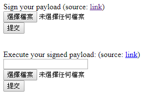

# DEF CON CTF Qualifier 2018 - Notes

## EASY PISY
> Description:
>
> Need to pass a pdf that starts with "EXECUTE " with a digital signature, the app only signs pdfs that start with "ECHO ".

> http://5a7f02d0.quals2018.oooverflow.io

打開題目頁面

有提供兩個檔案: `sign.php` 和 `execute.php`

php 的 openssl_verify 是使用 `sha1` 然後題目又是要用 `pdf`

可以直接聯想到 google 發現的 sha1 collision

關於openssl_verify 可以[參考](https://secure.php.net/manual/en/function.openssl-verify.php)

參考[ctftime_WriteUp](https://ctftime.org/task/6094)

