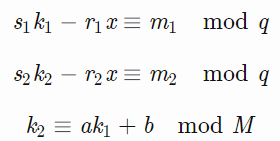
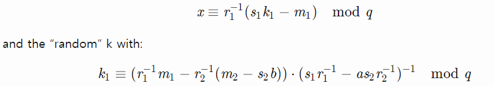

# VolgaCTF 2018 Quals - Notes


## Forbidden
> Description:
>
> Our friend tried to send us all his BTCs, but MAC of the transaction was lost. We need your help to compute MAC for this encrypted transaction.
> 
> Send it in format VolgaCTF{AuthTag_in_HEX}.

[參考](https://ctftime.org/task/5608)

這題我們有一組用 AES-GCM 作加密驗證的 Code

還有其 明文, 其加密後的密文, 附加的訊息, MAC ，然後目標是要產生另一個 MAC

而這題的漏洞在 iv reuse ，可參考 [paper](https://www.usenix.org/system/files/conference/woot16/woot16-paper-bock.pdf)

可以直接使用 [tool](https://github.com/nonce-disrespect/nonce-disrespect/tree/master/tool)

## Nonsense
> Description:
>
> We've intercepted several consecutive signatures. Take everything you need and find the secret key. Send it to us in hex.

[參考](https://ctftime.org/event/539)

[該題攻擊paper](https://link.springer.com/content/pdf/10.1007%2FBFb0052242.pdf)

可以得到如果有兩個 signature ，有該公式


反正可以做公式推導出最終結果



詳細過程可以[參考](https://github.com/VoidHack/write-ups/tree/master/VolgaCTF%202018%20Quals/crypto/Nonsense)


```python
#!/usr/bin/env python
import libnum
import hashlib

g = 88125476599184486094790650278890368754888757655708027167453919435240304366395317529470831972495061725782138055221217302201589783769854366885231779596493602609634987052252863192229681106120745605931395095346012008056087730365567429009621913663891364224332141824100071928803984724198563312854816667719924760795
y = 18433140630820275907539488836516835408779542939919052226997023049612786224410259583219376467254099629677919271852380455772458762645735404211432242965871926570632297310903219184400775850110990886397212284518923292433738871549404880989194321082225561448101852260505727288411231941413212099434438610673556403084
p = 89884656743115795425395461605176038709311877189759878663122975144592708970495081723016152663257074178905267744494172937616748015651504839967430700901664125135185879852143653824715409554960402343311756382635207838848036159350785779959423221882215217326708017212309285537596191495074550701770862125817284985959
q = 1118817215266473099401489299835945027713635248219

a = 3437776292996777467976657547577967657547
b = 828669865469592426262363475477574643634
m = 1118817215266473099401489299835945027713635248219

m1 = int(hashlib.md5("VolgaCTF{nKpV/dmkBeQ0n9Mz0g9eGQ==}").hexdigest(), 16)
r1,s1 = 1030409245884476193717141088285092765299686864672, 830067187231135666416948244755306407163838542785
m2 = int(hashlib.md5("VolgaCTF{KtetaQ4YT8PhTL3O4vsfDg==}").hexdigest(), 16)
r2,s2 = 403903893160663712713225718481237860747338118174, 803753330562964683180744246754284061126230157465

k1 = ((libnum.invmod(r1,q)*m1 - libnum.invmod(r2,q)*(m2-s2*b)) * libnum.invmod( s1*libnum.invmod(r1,q)-a*s2*libnum.invmod(r2,q),q)) % q
x = (libnum.invmod(r1,q) * (s1*k1 - m1))%q
```