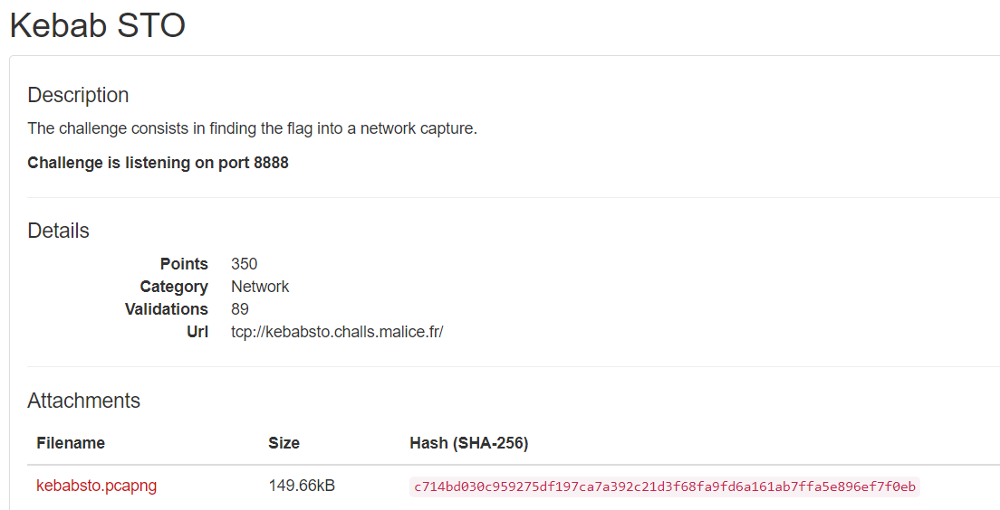

# Nuit du Hack CTF Quals 2018 - Notes

## So Stealthy
> Description:
>
> During an incident response, we captured the network traffic from a suspected compromised host. Could you help us reverse the installed malware?

用 wireshark 打開看， export object -> http

有很多檔案，一個個看，第二個 favicon.ico 有 base64 encode 的東西

把她 base64 decode 後會發現無法識別，用 xxd 看一下可以猜他是 .net 執行檔

用 HxD 把前面的垃圾拿掉，之後用 ILSpy 看一下

這裡可以看到他是做 xor

```
// AingeiRai5HahfeiThe2
private bool MeeBish0iotho9biBuJi(string magicWord)
{
	for (int i = 0; i < this.Tai8Aip0ua3ULi6zo1je.Length; i++)
	{
		uint num = (uint)(magicWord[i] ^ this.Tai8Aip0ua3ULi6zo1je[i]);
		if (num != this.az5nieghahj0Iekah0ph[i])
		{
			return false;
		}
	}
	return true;
}

```

xor 出來要等於以下

```
private int[] az5nieghahj0Iekah0ph = new int[22]
{
	21,
	91,
	20,
	0,
	126,
	0,
	61,
	24,
	2,
	82,
	7,
	17,
	88,
	22,
	18,
	21,
	114,
	117,
	15,
	80,
	59,
	24
};
```

如果正確會噴 flag
```
// AingeiRai5HahfeiThe2
using System;
using System.Diagnostics;
using System.Windows.Forms;

private void Eey4jie0raer7Miiphuo(object ahrah0iwoChohs2dai4a, EventArgs ahH5eedeiYohquei8goo)
{
	if (Debugger.IsAttached)
	{
		MessageBox.Show("Don't try your dirty tricks on me!");
	}
	else if (this.ta4vo2Ahk5yaep2oShuu.Text.Length == 0)
	{
		MessageBox.Show("You must fill this field!");
	}
	else if (this.MeeBish0iotho9biBuJi(this.ta4vo2Ahk5yaep2oShuu.Text))
	{
		MessageBox.Show("SUCCESS !\nSubmit NDH{" + this.ta4vo2Ahk5yaep2oShuu.Text + "} to validate.");
	}
	else
	{
		MessageBox.Show("YOU DIDN'T SAY THE MAGIC WORD !!!");
	}
}

```

而我們的輸入會和哪個做 xor 可以看到
```
// AingeiRai5HahfeiThe2
public void Aa6bi4uidan4shahSee9(string ain7aek2Thae3Boh7ohh)
{
	this.Tai8Aip0ua3ULi6zo1je = ain7aek2Thae3Boh7ohh.Substring(ain7aek2Thae3Boh7ohh.Length - 22);
}
```

所以回去看一下一開始的 js code (在 favicon.ico 那)，可以知道是
```
FkKEJ5dGVbXSkIAAAACgsA
```

簡單寫個 code 解
```
key = "FkKEJ5dGVbXSkIAAAACgsA"
xorKey = [21,91,20,0,126,0,61,24,2,82,7,17,88,22,18,21,114,117,15,80,59,24]
flag = ""
for i in range(len(key)):
	flag += chr(ord(key[i])^ xorKey[i])
```

## Kebab STO
> Description:
> 
> The challenge consists in finding the flag into a network capture.

用 wireshark 的 export object -> http 可以拉出一個檔案是 zip ，解出來

可以得到另一個 封包檔，他是 802.11 的且無法看到封包內容

```
$ aircrack-ng ./a.pcap -w /usr/share/wordlists/rockyou.txt
```

可以知道密碼是 abcdefgh

添加密碼到 wireshark 可以參考[這篇](https://wiki.wireshark.org/HowToDecrypt802.11)

在 stream 7 可以把 zip 給拿出來
(先 follow tcp stream ，之後以 raw 的格式儲存)

但有密碼，回去最一開始的 pcap ，看 stream 13 

也有一個用 base64 encode 的 zip 可以拿出來

可以得到 ciphertext 和 pubkey 

然後該 stream 13 上面有一段提示
```
Besides, they also found a service at mydomainndh.ndh (port 55555) which
decrypts every text encrypted with the public key, apart from the
interesting one.
``` 

然後我們回到題目頁面



所以可以連上去，然後把我們的 ciphertext 丟給她解
```
$ nc kebabsto.challs.malice.fr 8888
What message do you want to decrypt: 72873754879996948796542757182427480866384878894019674005699447004829908491467629529161961884224325941110935083467870715412599916138560976722953815670278067115980556377912852138532905866093650699880301357138301236748217037629036311469031537013958415575513723738671978421707050599317605219729945496472798064172
72873754879996948796542757182427480866384878894019674005699447004829908491467629529161961884224325941110935083467870715412599916138560976722953815670278067115980556377912852138532905866093650699880301357138301236748217037629036311469031537013958415575513723738671978421707050599317605219729945496472798064172


Here is the cleartext of your input :


123360975347216093033775350245751721746535757669936

===
In [24]: libnum.n2s(123360975347216093033775350245751721746535757669936)
Out[24]: 'Th1s1s2P@ss_W0rd%M0f0'
```

把這個明文拿去解剛剛要密碼的 zip 就可以得到 flag

