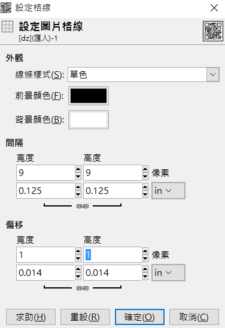

# Pragyan CTF 2018 - Notes


## Ears to the rescue
> Description:
>
> Jack is trapped inside a room. All he can see and hear is a sound, his ears hear only the specific sound. He needs to escape, help him figure out what the sound means.


直接丟 audacity 看波形可以看到有八個向度，也就是
```
000
001
010
011
100
101
110
111
```

轉 octal to ascii 即可

## Quick Response
> Description:
>
> Tony had created a QR code for a specific purpose, and sent to his friend Rhody for deployment but when deployed, the QR code wasn’t working as it was supposed to. Figure out what’s wrong and help fix the problem.

[參考](https://rawsec.ml/en/PragyanCTF-2018-write-ups/#100-quick-response-forensics)

直接 google 搜尋 qr code ，可以比對發現，他的三格的點太少，補齊即可

使用 GIMP ，檢視 -> 顯示格線

之後 圖片 -> 設定格線


之後可以[參考這篇](http://gimpbasic.blogspot.tw/2011/10/54.html)作上色

```
$ zbarimg final.png
QR-Code:The flag is: pctf{r3p4ir1nG~Qr_1s-my_h0bBy}
scanned 1 barcode symbols from 1 images in 0.08 seconds
```

## Scientist’s research
> Description:
>
> Mary, a data scientist, specializing in CNN, has been working on a problem, she has recorded her observations in a table. Have a look at the data and deduce the flag.

題目給了一個 excel ，先一直縮小，就可以看到 flag (需要翻轉)

## Pictorial mess 
> Description:
>
> Johnny had an image that he was going to use for a very important purpose. Someone had hacked into his system and tampered with the image. Help him recover it.
>
> Hint:
> The characters in the images read "Make me tall", but that's not the flag.

先用 stegsolve 可以看到圖片提示: Make me tall

這樣去改 png 的高度，可以[參考](https://github.com/corkami/pics/blob/master/binary/PNG.png)

改高一點可以看到多了一些東西，做紀錄

```
11111101111110101111
11111011111111111111
10101011000101110011
00001001110010000101
00110000111100001011
01011110110001101000
01001011100001111001
###
flag = [0b1110000, 0b1100011, 0b1110100, 0b1100110, 0b1111011, 0b1000010]
flag+= [0b0110011, 0b1111001, 0b1101111, 0b1101110, 0b1100100, 0b1110100]
flag+= [0b1101000, 0b0110011, 0b1110011, 0b0110001, 0b1100111, 0b1101000, 0b1110100, 0b1111101]
for i in flag:
	print chr(i),
```