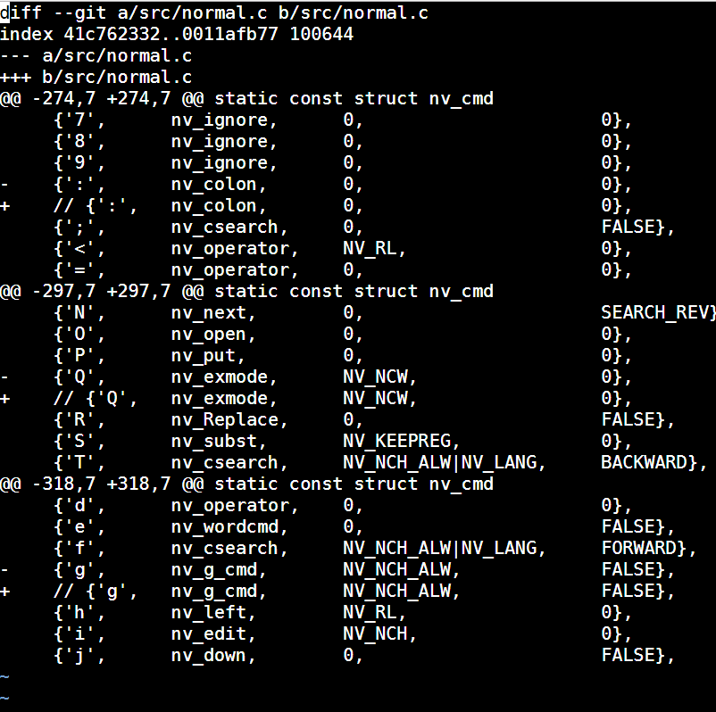

# TokyoWesterns CTF 4th 2018 - Notes

## vimshell
> Description:
>
> Can you escape from jail?

打開網頁長這樣


就是給我們一個 vim 環境，然後根據他給的 diff 可以知道 `:` 、 `g` 、 `Q` 這些都不能用

但可以在 diff 那按 `K` ，這樣會進入到 man 環境下，就可以 `! cat /flag`

或在 insert mode 下面用 `ctrl-r + =` 之後 `system('cat /flag')`


## mondai.zip

給我們一個 zip ，解壓縮得到另一個 zip `y0k0s0.zip` ，再一次解壓縮要密碼

直接拿 `y0k0s0` 就是密碼，得到另一個 zip 和 pcap ，

所以第一個密碼是: `y0k0s0`

而得到的 zip 要密碼應該是要從 pcap 中拿


這邊可以觀察到只有 ping 到 192.168.11.5 沒有出錯

這邊看到別人解法是，找是 ping 192.168.11.5 的 packet ，娶他的 load 長度轉 ascii 就是密碼= =

[參考](https://github.com/TryCTFAgain/CTF-Writeups/tree/master/2018/Tokyo%20Western%20CTF/%5BMisc%5D%20mondai.zip)

第二個密碼是: `We1come`

解開來得到一個 zip 和 list.txt ，看起來應該是list 的某行是密碼

寫個程式最終可以得到

第三個密碼是: `eVjbtTpvkU`

解開來得到 `1c9ed78bab3f2d33140cbce7ea223894` 是一個 zip 檔案

看一下長度是 32 ，可以猜是 md5 ，丟到 `www.cmd5.com` 可以得到答案

第四個密碼是: `happyhappyhappy`

在解壓縮得到提示說密碼太短，這代表可以爆破

直接用 fcrackzip : `fcrackzip -b -l 1-3 -v -u mondai.zip`
```python
-b: brute force
-l: 長度
-u: 使用 unzip 後面接 zip 檔
```

可以瞬間找到密碼

第五個密碼是: `to`

最後得到 secret.txt:

```
Congratulation!
You got my secret!

Please replace as follows:
(1) = first password
(2) = second password
(3) = third password
...

TWCTF{(2)_(5)_(1)_(4)_(3)}
```

## pysandbox
> Description:
>
> let's break sandbox.
> start from nc pwn1.chal.ctf.westerns.tokyo 30001
> 
> Update(2018-09-01 10:22 UTC):
> slightly patched sandbox.py to avoid netcat issues.
> 
```
81c81
<     expr = sys.stdin.read()
---
>     expr = sys.stdin.readline()
```

[CTFtime_WriteUp](https://ctftime.org/task/6513)


