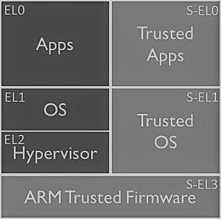
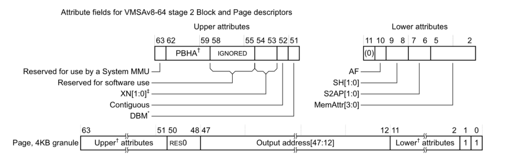

# HITCON CTF 2018 - Notes

## Baby Tcache
> Description:
>
> Tcache so fun! Baby, don't do it first.
> 
> nc 52.68.236.186 56746

## Children Tcache
> Description:
>
> Try more tcache :)
> 
> nc 54.178.132.125 8763

## tftp
> Description:
>
> A simple tftp server on tcp.
> 
> nc 52.68.37.204 48763

## Groot
> Description:
>
> I am Groot.
> 
> nc 54.238.202.201 31733

## Abyss I
> Description:
>
> The Edge of the Abyss
> 
> nc 35.200.23.198 31733

## Abyss II
> Description:
>
> The Forest of Temptation

## Abyss III
> Description:
>
> The Great Fault

## HITCON
> Description:
>
> Honey Island Taiwan CONference 2018 is coming!
> 
> nc 13.115.73.78 31733

## windowsland
> Description:
>
> Feel too many linux and want to try something new ?
> 
> nc 13.231.142.96 6677

## Super Hexagon
> Description:
>
> Escape each level for your six flags.
> 
> EL0 - Hard
> EL1 - Harder
> EL2 - Hardest
> S-EL0 - Hardester
> S-EL1 - Hardestest
> S-EL3 - Hardestestest
> nc 54.64.96.126 6666

hint1:

hint2:

## Secret Note
> Description:
>
> plz read the note
> 
> nc 52.194.203.194 21700

## Secret Note v2
> Description:
>
> UPDATE: Running on Ubuntu 18.04
> 
> plz get the shell
> 
> nc 52.194.203.194 21700

## unexecutable
> Description:
>
> No code, no bug.
> 
> nc 52.198.163.80 31733
