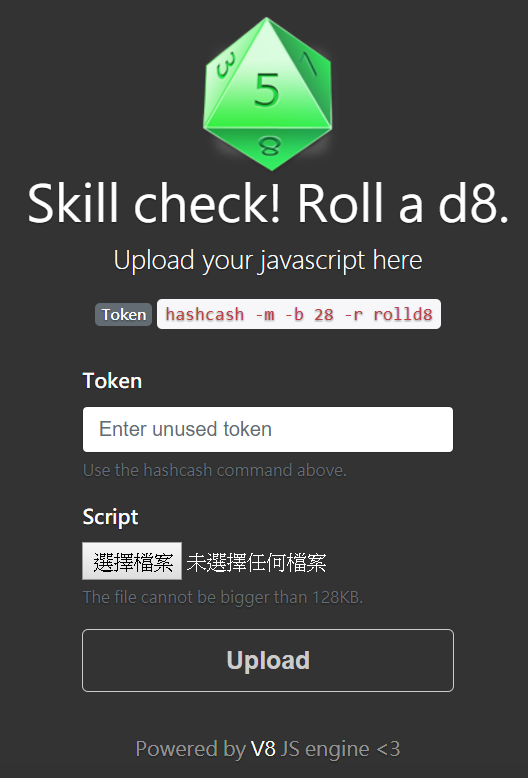

# PlaidCTF 2018 - Notes

## shop
[參考](https://ctftime.org/task/6065)

程式一開始要我們輸入名字後，之後可以用 4 個功能

1. `a` add item
2. `l` list items
3. `n` name shop
4. `c` checkout

## roll a d8
> Description:
>
> [Roll a d8](http://rolld8.chal.pwning.xxx:4000/) and win your game. 
>
> Last year, hackers successfully exploited Chakrazy. 
> This time, we came back with d8 powered by V8 JavaScript engine. 
>
> You can download relevant material [here](https://play.plaidctf.com/files/d8_d97a796c6c189bbb350942ea5d92f4dd.tar.xz). 
>
> This might only be helpful to Google employees... or is it? https://crbug.com/821137

打開網址

## garbagetruck

[ctftime_writeup](https://ctftime.org/task/6078)

stack 上有一個陣列可以觸發 overflow 來使用 rop chain ，只是 rop chain 只允許質數

