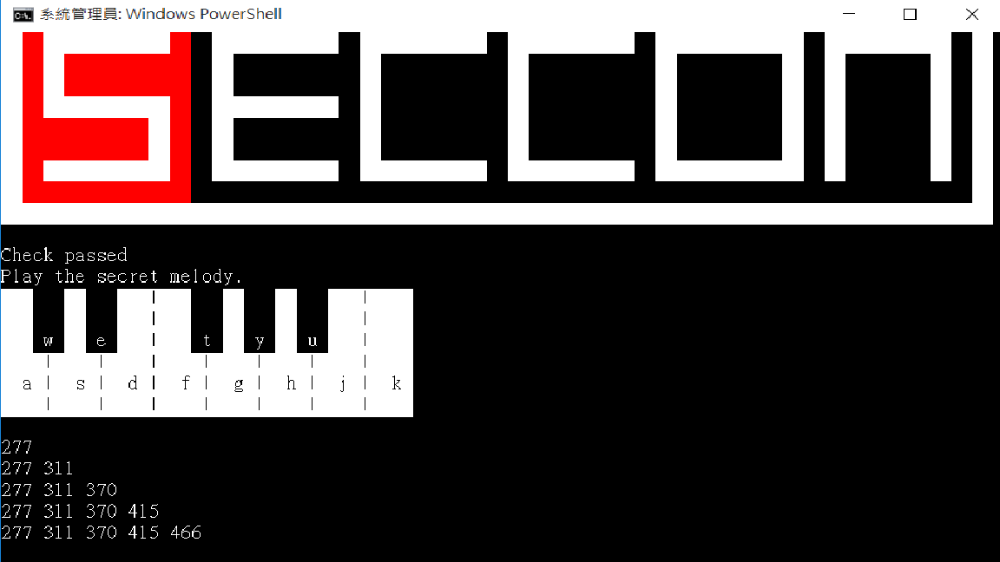

# SECCON CTF Quals 2017 - Notes

## JPEG file

> Description:
> 
> Read this JPEG is broken.
> It will be fixed if you change somewhere by 1 bit

依題目說是要修復一個 bit

先用
```
root@lubun1704:/tmp/p# jpeginfo -cvi ./a.jpg
./a.jpg  339 x 53   24bit JFIF  Normal Huffman,192dpi   11628  Corrupt JPEG data: premature end of data segment  Unsupported marker type 0xfc  [ERROR]
```

依照 jpeg doucment
> If a 0xff byte occurs in the compressed image data either a zero byte (0x00) or a marker identifier follows it. Normally the only marker that should be found once the image data is started is an EOI. When a 0xff byte is found followed by a zero byte (0x00) the zero byte must be discarded.

也就是 jpg 檔案的 \xff 後面會接 \x00 或者是辨識符號，

除了最開始 \xff 後面接的是辨識外，其他底下都是 \xff\x00 ，但有一個是 \xff\xfc

把 \xfc 改成 \x00 即可

也可以用 magick 檢查，[官方](https://www.imagemagick.org/script/identify.php)
```
$ magick identify -verbose tktk.jpg
```


## Powerful_Shell

先看檔案。全部都是給變數值，如底下
```
$ECCON+=[char](1047-989);
$ECCON+=[char](-720+785);
$ECCON+=[char](826-743);
$ECCON+=[char](28274/422);
$ECCON+=[char](-399+472);
$ECCON+=[char](28616/392);
$ECCON+=[char](12420/270);
$ECCON+=[char](38340/540);
$ECCON+=[char](73629/729);
$ECCON+=[char](325-209);
$ECCON+=[char](-861+944);
...
...
...
```
只有最底不一樣
```
Write-Progress -Activity "Extracting Script" -status "20040" -percentComplete 99;
$ECCON+=[char](520-510);
Write-Progress -Completed -Activity "Extracting Script";.([ScriptBlock]::Create($ECCON))
```

可以看到最後有一個 Create($ECCON) ，那把它轉存到一個檔案來看，在最底下加

```powershell
Write-Output $ECCON >> d:\aaaa.txt
```

可以看到裡面內容是
```powershell

$ErrorActionPreference = "ContinueSilently"
[console]::BackgroundColor = "black";[console]::ForegroundColor = "white";cls;Set-Alias -Name x -Value Write-Host;$host.UI.RawUI.BufferSize = New-Object System.Management.Automation.Host.Size 95,25;$host.UI.RawUI.WindowSize = New-Object System.Management.Automation.Host.Size 95,25;$host.UI.RawUI.BufferSize = New-Object System.Management.Automation.Host.Size 95,25;$host.UI.RawUI.WindowSize = New-Object System.Management.Automation.Host.Size 95,25;x '  ' -b 0 -n;x '  ' -b 0 -n;x '  ' -b 0 -n;x '  ' -b 0 -n;x '  ' -b 0 -n;x '  ' -b 0 -n;x '  ' -b 0 -n;x '  ' -b 0 -n;x '  ' -b 0 -n;x '  ' -b 0 -n;x '  ' -b 0 -n;x '  ' -b 0 -n;x '  ' -b 0 -n;x '  ' -b 0 -n;x '  ' -b 0 -n;x '  ' -b 0 -n;x '  ' -b 0 -n;x '  ' -b 0 -n;x '  ' -b 0 -n;x '  ' -b 0 -n;x '  ' -b 0 -n;x '  ' -b 0 -n;x '  ' -b 0 -n;x '  ' -b 0 -n;x '  ' -b 0 -n;x '  ' -b 0 -n;x '  ' -b 0 -n;x '  ' -b 0 -n;x '  ' -b 0 -n;x '  ' -b 0 -n;x '  ' -b 0 -n;x '  ' -b 0 -n;x '  ' -b 0 -n;x '  ' -b 0 -n;x '  ' -b 0 -n;x '  ' -b 0 -n;x '  ' -b 0 -n;x '  ' -b 0 -n;x '  ' -b 0 -n;x '  ' -b 0 -n;x '  ' -b 0 -n;x '  ' -b 0 -n;x '  ' -b 0 -n;x '  ' -b 0 -n;x '  ' -b 0 -n;x '  ' -b 0 -n;x '  ' -b 0 -n;x;x '  ' -b 0 -n;x '  ' -b 0 -n;x '  ' -b 0 -n;x '  ' -b 0 -n;x '  ' -b 0 -n;x '  ' -b 0 -n;x '  ' -b 0 -n;x '  ' -b 0 -n;x '  ' -b 0 -n;x '  ' -b 0 -n;x '  ' -b 0 -n;x '  ' -b 0 -n;x '  ' -b 0 -n;x '  ' -b 0 -n;x '  ' -b 0 -n;x '  ' -b 0 -n;x '  ' -b 0 -n;x '  ' -b 0 -n;x '  ' -b 0 -n;x '  ' -b 0 -n;x '  ' -b 0 -n;x '  ' -b 0 -n;x '  ' -b 0 -n;x '  ' -b 0 -n;x '  ' -b 0 -n;x '  ' -b 0 -n;x '  ' -b 0 -n;x '  ' -b 0 -n;x '  ' -b 0 -n;x '  ' -b 0 -n;x '  ' -b 0 -n;x '  ' -b 0 -n;x '  ' -b 0 -n;x '  ' -b 0 -n;x '  ' -b 0 -n;x '  ' -b 0 -n;x '  ' -b 0 -n;x '  ' -b 0 -n;x '  ' -b 0 -n;x '  ' -b 0 -n;x '  ' -b 0 -n;x '  ' -b 0 -n;x '  ' -b 0 -n;x '  ' -b 0 -n;x '  ' -b 0 -n;x '  ' -b 0 -n;x '  ' -b 0 -n;x;x '  ' -b 0 -n;x '  ' -b 0 -n;x '  ' -b 0 -n;x '  ' -b 0 -n;x '  ' -b 0 -n;x '  ' -b 0 -n;x '  ' -b 0 -n;x '  ' -b 0 -n;x '  ' -b 0 -n;x '  ' -b 0 -n;x '  ' -b 0 -n;x '  ' -b 0 -n;x '  ' -b 0 -n;x '  ' -b 0 -n;x '  ' -b 0 -n;x '  ' -b 0 -n;x '  ' -b 0 -n;x '  ' -b 0 -n;x '  ' -b 0 -n;x '  ' -b 0 -n;x '  ' -b 0 -n;x '  ' -b 0 -n;x '  ' -b 0 -n;x '  ' -b 0 -n;x '  ' -b 0 -n;x '  ' -b 0 -n;x '  ' -b 0 -n;x '  ' -b 0 -n;x '  ' -b 0 -n;x '  ' -b 0 -n;x '  ' -b 0 -n;x '  ' -b 0 -n;x '  ' -b 0 -n;x '  ' -b 0 -n;x '  ' -b 0 -n;x '  ' -b 0 -n;x '  ' -b 0 -n;x '  ' -b 0 -n;x '  ' -b 0 -n;x '  ' -b 0 -n;x '  ' -b 0 -n;x '  ' -b 0 -n;x '  ' -b 0 -n;x '  ' -b 0 -n;x '  ' -b 0 -n;x '  ' -b 0 -n;x '  ' -b 0 -n;x;x '  ' -b 0 -n;x '  ' -b 0 -n;x '  ' -b 0 -n;x '  ' -b 0 -n;x '  ' -b 0 -n;x '  ' -b 0 -n;x '  ' -b 0 -n;x '  ' -b 0 -n;x '  ' -b 0 -n;x '  ' -b 0 -n;x '  ' -b 0 -n;x '  ' -b 0 -n;x '  ' -b 0 -n;x '  ' -b 0 -n;x '  ' -b 0 -n;x '  ' -b 0 -n;x '  ' -b 0 -n;x '  ' -b 0 -n;x '  ' -b 0 -n;x '  ' -b 0 -n;x '  ' -b 0 -n;x '  ' -b 0 -n;x '  ' -b 0 -n;x '  ' -b 0 -n;x '  ' -b 0 -n;x '  ' -b 0 -n;x '  ' -b 0 -n;x '  ' -b 0 -n;x '  ' -b 0 -n;x '  ' -b 0 -n;x '  ' -b 0 -n;x '  ' -b 0 -n;x '  ' -b 0 -n;x '  ' -b 0 -n;x '  ' -b 0 -n;x '  ' -b 0 -n;x '  ' -b 0 -n;x '  ' -b 0 -n;x '  ' -b 0 -n;x '  ' -b 0 -n;x '  ' -b 0 -n;x '  ' -b 0 -n;x '  ' -b 0 -n;x '  ' -b 0 -n;x '  ' -b 0 -n;x '  ' -b 0 -n;x '  ' -b 0 -n;x;x '  ' -b 0 -n;x '  ' -b 0 -n;x '  ' -b 0 -n;x '  ' -b 0 -n;x '  ' -b 0 -n;x '  ' -b 0 -n;x '  ' -b 0 -n;x '  ' -b 0 -n;x '  ' -b 0 -n;x '  ' -b 0 -n;x '  ' -b 0 -n;x '  ' -b 0 -n;x '  ' -b 0 -n;x '  ' -b 0 -n;x '  ' -b 0 -n;x '  ' -b 0 -n;x '  ' -b 0 -n;x '  ' -b 0 -n;x '  ' -b 0 -n;x '  ' -b 0 -n;x '  ' -b 0 -n;x '  ' -b 0 -n;x '  ' -b 0 -n;x '  ' -b 0 -n;x '  ' -b 0 -n;x '  ' -b 0 -n;x '  ' -b 0 -n;x '  ' -b 0 -n;x '  ' -b 0 -n;x '  ' -b 0 -n;x '  ' -b 0 -n;x '  ' -b 0 -n;x '  ' -b 0 -n;x '  ' -b 0 -n;x '  ' -b 0 -n;x '  ' -b 0 -n;x '  ' -b 0 -n;x '  ' -b 0 -n;x '  ' -b 0 -n;x '  ' -b 0 -n;x '  ' -b 0 -n;x '  ' -b 0 -n;x '  ' -b 0 -n;x '  ' -b 0 -n;x '  ' -b 0 -n;x '  ' -b 0 -n;x '  ' -b 0 -n;x;x '  ' -b 0 -n;x '  ' -b 0 -n;x '  ' -b 0 -n;x '  ' -b 0 -n;x '  ' -b 0 -n;x '  ' -b 0 -n;x '  ' -b 0 -n;x '  ' -b 0 -n;x '  ' -b 0 -n;x '  ' -b 0 -n;x '  ' -b 0 -n;x '  ' -b 0 -n;x '  ' -b 0 -n;x '  ' -b 0 -n;x '  ' -b 0 -n;x '  ' -b 0 -n;x '  ' -b 0 -n;x '  ' -b 0 -n;x '  ' -b 0 -n;x '  ' -b 0 -n;x '  ' -b 0 -n;x '  ' -b 0 -n;x '  ' -b 0 -n;x '  ' -b 0 -n;x '  ' -b 0 -n;x '  ' -b 0 -n;x '  ' -b 0 -n;x '  ' -b 0 -n;x '  ' -b 0 -n;x '  ' -b 0 -n;x '  ' -b 0 -n;x '  ' -b 0 -n;x '  ' -b 0 -n;x '  ' -b 0 -n;x '  ' -b 0 -n;x '  ' -b 0 -n;x '  ' -b 0 -n;x '  ' -b 0 -n;x '  ' -b 0 -n;x '  ' -b 0 -n;x '  ' -b 0 -n;x '  ' -b 0 -n;x '  ' -b 0 -n;x '  ' -b 0 -n;x '  ' -b 0 -n;x '  ' -b 0 -n;x '  ' -b 0 -n;x;x '  ' -b 0 -n;x '  ' -b 0 -n;x '  ' -b 0 -n;x '  ' -b 0 -n;x '  ' -b 0 -n;x '  ' -b 0 -n;x '  ' -b 0 -n;x '  ' -b 0 -n;x '  ' -b 0 -n;x '  ' -b 0 -n;x '  ' -b 0 -n;x '  ' -b 0 -n;x '  ' -b 0 -n;x '  ' -b 0 -n;x '  ' -b 0 -n;x '  ' -b 0 -n;x '  ' -b 0 -n;x '  ' -b 0 -n;x '  ' -b 0 -n;x '  ' -b 0 -n;x '  ' -b 0 -n;x '  ' -b 0 -n;x '  ' -b 0 -n;x '  ' -b 0 -n;x '  ' -b 0 -n;x '  ' -b 0 -n;x '  ' -b 0 -n;x '  ' -b 0 -n;x '  ' -b 0 -n;x '  ' -b 0 -n;x '  ' -b 0 -n;x '  ' -b 0 -n;x '  ' -b 0 -n;x '  ' -b 0 -n;x '  ' -b 0 -n;x '  ' -b 0 -n;x '  ' -b 0 -n;x '  ' -b 0 -n;x '  ' -b 0 -n;x '  ' -b 0 -n;x '  ' -b 0 -n;x '  ' -b 0 -n;x '  ' -b 0 -n;x '  ' -b 0 -n;x '  ' -b 0 -n;x '  ' -b 0 -n;x '  ' -b 0 -n;x;x '  ' -b 15 -n;x '  ' -b 15 -n;x '  ' -b 15 -n;x '  ' -b 15 -n;x '  ' -b 15 -n;x '  ' -b 15 -n;x '  ' -b 15 -n;x '  ' -b 15 -n;x '  ' -b 15 -n;x '  ' -b 15 -n;x '  ' -b 15 -n;x '  ' -b 15 -n;x '  ' -b 15 -n;x '  ' -b 15 -n;x '  ' -b 15 -n;x '  ' -b 15 -n;x '  ' -b 15 -n;x '  ' -b 15 -n;x '  ' -b 15 -n;x '  ' -b 15 -n;x '  ' -b 15 -n;x '  ' -b 15 -n;x '  ' -b 15 -n;x '  ' -b 15 -n;x '  ' -b 15 -n;x '  ' -b 15 -n;x '  ' -b 15 -n;x '  ' -b 15 -n;x '  ' -b 15 -n;x '  ' -b 15 -n;x '  ' -b 15 -n;x '  ' -b 15 -n;x '  ' -b 15 -n;x '  ' -b 15 -n;x '  ' -b 15 -n;x '  ' -b 15 -n;x '  ' -b 15 -n;x '  ' -b 15 -n;x '  ' -b 15 -n;x '  ' -b 15 -n;x '  ' -b 15 -n;x '  ' -b 15 -n;x '  ' -b 15 -n;x '  ' -b 15 -n;x '  ' -b 15 -n;x '  ' -b 15 -n;x '  ' -b 15 -n;x;x '  ' -b 15 -n;x '  ' -b 12 -n;x '  ' -b 12 -n;x '  ' -b 12 -n;x '  ' -b 12 -n;x '  ' -b 12 -n;x '  ' -b 12 -n;x '  ' -b 12 -n;x '  ' -b 12 -n;x '  ' -b 0 -n;x '  ' -b 0 -n;x '  ' -b 0 -n;x '  ' -b 0 -n;x '  ' -b 0 -n;x '  ' -b 0 -n;x '  ' -b 0 -n;x '  ' -b 0 -n;x '  ' -b 0 -n;x '  ' -b 0 -n;x '  ' -b 0 -n;x '  ' -b 0 -n;x '  ' -b 0 -n;x '  ' -b 0 -n;x '  ' -b 0 -n;x '  ' -b 0 -n;x '  ' -b 0 -n;x '  ' -b 0 -n;x '  ' -b 0 -n;x '  ' -b 0 -n;x '  ' -b 0 -n;x '  ' -b 0 -n;x '  ' -b 0 -n;x '  ' -b 0 -n;x '  ' -b 0 -n;x '  ' -b 0 -n;x '  ' -b 0 -n;x '  ' -b 0 -n;x '  ' -b 0 -n;x '  ' -b 0 -n;x '  ' -b 0 -n;x '  ' -b 0 -n;x '  ' -b 0 -n;x '  ' -b 0 -n;x '  ' -b 0 -n;x '  ' -b 0 -n;x '  ' -b 0 -n;x '  ' -b 15 -n;x;x '  ' -b 15 -n;x '  ' -b 12 -n;x '  ' -b 15 -n;x '  ' -b 15 -n;x '  ' -b 15 -n;x '  ' -b 15 -n;x '  ' -b 15 -n;x '  ' -b 15 -n;x '  ' -b 12 -n;x '  ' -b 0 -n;x '  ' -b 15 -n;x '  ' -b 15 -n;x '  ' -b 15 -n;x '  ' -b 15 -n;x '  ' -b 15 -n;x '  ' -b 15 -n;x '  ' -b 0 -n;x '  ' -b 15 -n;x '  ' -b 15 -n;x '  ' -b 15 -n;x '  ' -b 15 -n;x '  ' -b 15 -n;x '  ' -b 15 -n;x '  ' -b 0 -n;x '  ' -b 15 -n;x '  ' -b 15 -n;x '  ' -b 15 -n;x '  ' -b 15 -n;x '  ' -b 15 -n;x '  ' -b 15 -n;x '  ' -b 0 -n;x '  ' -b 15 -n;x '  ' -b 15 -n;x '  ' -b 15 -n;x '  ' -b 15 -n;x '  ' -b 15 -n;x '  ' -b 15 -n;x '  ' -b 15 -n;x '  ' -b 0 -n;x '  ' -b 15 -n;x '  ' -b 15 -n;x '  ' -b 15 -n;x '  ' -b 15 -n;x '  ' -b 15 -n;x '  ' -b 15 -n;x '  ' -b 0 -n;x '  ' -b 15 -n;x;x '  ' -b 15 -n;x '  ' -b 12 -n;x '  ' -b 15 -n;x '  ' -b 12 -n;x '  ' -b 12 -n;x '  ' -b 12 -n;x '  ' -b 12 -n;x '  ' -b 12 -n;x '  ' -b 12 -n;x '  ' -b 0 -n;x '  ' -b 15 -n;x '  ' -b 0 -n;x '  ' -b 0 -n;x '  ' -b 0 -n;x '  ' -b 0 -n;x '  ' -b 0 -n;x '  ' -b 0 -n;x '  ' -b 15 -n;x '  ' -b 0 -n;x '  ' -b 0 -n;x '  ' -b 0 -n;x '  ' -b 0 -n;x '  ' -b 0 -n;x '  ' -b 0 -n;x '  ' -b 15 -n;x '  ' -b 0 -n;x '  ' -b 0 -n;x '  ' -b 0 -n;x '  ' -b 0 -n;x '  ' -b 0 -n;x '  ' -b 0 -n;x '  ' -b 15 -n;x '  ' -b 0 -n;x '  ' -b 0 -n;x '  ' -b 0 -n;x '  ' -b 0 -n;x '  ' -b 0 -n;x '  ' -b 15 -n;x '  ' -b 0 -n;x '  ' -b 15 -n;x '  ' -b 0 -n;x '  ' -b 0 -n;x '  ' -b 0 -n;x '  ' -b 0 -n;x '  ' -b 15 -n;x '  ' -b 0 -n;x '  ' -b 15 -n;x;x '  ' -b 15 -n;x '  ' -b 12 -n;x '  ' -b 15 -n;x '  ' -b 12 -n;x '  ' -b 12 -n;x '  ' -b 12 -n;x '  ' -b 12 -n;x '  ' -b 12 -n;x '  ' -b 12 -n;x '  ' -b 0 -n;x '  ' -b 15 -n;x '  ' -b 0 -n;x '  ' -b 0 -n;x '  ' -b 0 -n;x '  ' -b 0 -n;x '  ' -b 0 -n;x '  ' -b 0 -n;x '  ' -b 15 -n;x '  ' -b 0 -n;x '  ' -b 0 -n;x '  ' -b 0 -n;x '  ' -b 0 -n;x '  ' -b 0 -n;x '  ' -b 0 -n;x '  ' -b 15 -n;x '  ' -b 0 -n;x '  ' -b 0 -n;x '  ' -b 0 -n;x '  ' -b 0 -n;x '  ' -b 0 -n;x '  ' -b 0 -n;x '  ' -b 15 -n;x '  ' -b 0 -n;x '  ' -b 0 -n;x '  ' -b 0 -n;x '  ' -b 0 -n;x '  ' -b 0 -n;x '  ' -b 15 -n;x '  ' -b 0 -n;x '  ' -b 15 -n;x '  ' -b 0 -n;x '  ' -b 0 -n;x '  ' -b 0 -n;x '  ' -b 0 -n;x '  ' -b 15 -n;x '  ' -b 0 -n;x '  ' -b 15 -n;x;x '  ' -b 15 -n;x '  ' -b 12 -n;x '  ' -b 15 -n;x '  ' -b 15 -n;x '  ' -b 15 -n;x '  ' -b 15 -n;x '  ' -b 15 -n;x '  ' -b 15 -n;x '  ' -b 12 -n;x '  ' -b 0 -n;x '  ' -b 15 -n;x '  ' -b 15 -n;x '  ' -b 15 -n;x '  ' -b 15 -n;x '  ' -b 15 -n;x '  ' -b 15 -n;x '  ' -b 0 -n;x '  ' -b 15 -n;x '  ' -b 0 -n;x '  ' -b 0 -n;x '  ' -b 0 -n;x '  ' -b 0 -n;x '  ' -b 0 -n;x '  ' -b 0 -n;x '  ' -b 15 -n;x '  ' -b 0 -n;x '  ' -b 0 -n;x '  ' -b 0 -n;x '  ' -b 0 -n;x '  ' -b 0 -n;x '  ' -b 0 -n;x '  ' -b 15 -n;x '  ' -b 0 -n;x '  ' -b 0 -n;x '  ' -b 0 -n;x '  ' -b 0 -n;x '  ' -b 0 -n;x '  ' -b 15 -n;x '  ' -b 0 -n;x '  ' -b 15 -n;x '  ' -b 0 -n;x '  ' -b 0 -n;x '  ' -b 0 -n;x '  ' -b 0 -n;x '  ' -b 15 -n;x '  ' -b 0 -n;x '  ' -b 15 -n;x;x '  ' -b 15 -n;x '  ' -b 12 -n;x '  ' -b 12 -n;x '  ' -b 12 -n;x '  ' -b 12 -n;x '  ' -b 12 -n;x '  ' -b 12 -n;x '  ' -b 15 -n;x '  ' -b 12 -n;x '  ' -b 0 -n;x '  ' -b 15 -n;x '  ' -b 0 -n;x '  ' -b 0 -n;x '  ' -b 0 -n;x '  ' -b 0 -n;x '  ' -b 0 -n;x '  ' -b 0 -n;x '  ' -b 15 -n;x '  ' -b 0 -n;x '  ' -b 0 -n;x '  ' -b 0 -n;x '  ' -b 0 -n;x '  ' -b 0 -n;x '  ' -b 0 -n;x '  ' -b 15 -n;x '  ' -b 0 -n;x '  ' -b 0 -n;x '  ' -b 0 -n;x '  ' -b 0 -n;x '  ' -b 0 -n;x '  ' -b 0 -n;x '  ' -b 15 -n;x '  ' -b 0 -n;x '  ' -b 0 -n;x '  ' -b 0 -n;x '  ' -b 0 -n;x '  ' -b 0 -n;x '  ' -b 15 -n;x '  ' -b 0 -n;x '  ' -b 15 -n;x '  ' -b 0 -n;x '  ' -b 0 -n;x '  ' -b 0 -n;x '  ' -b 0 -n;x '  ' -b 15 -n;x '  ' -b 0 -n;x '  ' -b 15 -n;x;x '  ' -b 15 -n;x '  ' -b 12 -n;x '  ' -b 12 -n;x '  ' -b 12 -n;x '  ' -b 12 -n;x '  ' -b 12 -n;x '  ' -b 12 -n;x '  ' -b 15 -n;x '  ' -b 12 -n;x '  ' -b 0 -n;x '  ' -b 15 -n;x '  ' -b 0 -n;x '  ' -b 0 -n;x '  ' -b 0 -n;x '  ' -b 0 -n;x '  ' -b 0 -n;x '  ' -b 0 -n;x '  ' -b 15 -n;x '  ' -b 0 -n;x '  ' -b 0 -n;x '  ' -b 0 -n;x '  ' -b 0 -n;x '  ' -b 0 -n;x '  ' -b 0 -n;x '  ' -b 15 -n;x '  ' -b 0 -n;x '  ' -b 0 -n;x '  ' -b 0 -n;x '  ' -b 0 -n;x '  ' -b 0 -n;x '  ' -b 0 -n;x '  ' -b 15 -n;x '  ' -b 0 -n;x '  ' -b 0 -n;x '  ' -b 0 -n;x '  ' -b 0 -n;x '  ' -b 0 -n;x '  ' -b 15 -n;x '  ' -b 0 -n;x '  ' -b 15 -n;x '  ' -b 0 -n;x '  ' -b 0 -n;x '  ' -b 0 -n;x '  ' -b 0 -n;x '  ' -b 15 -n;x '  ' -b 0 -n;x '  ' -b 15 -n;x;x '  ' -b 15 -n;x '  ' -b 12 -n;x '  ' -b 15 -n;x '  ' -b 15 -n;x '  ' -b 15 -n;x '  ' -b 15 -n;x '  ' -b 15 -n;x '  ' -b 15 -n;x '  ' -b 12 -n;x '  ' -b 0 -n;x '  ' -b 15 -n;x '  ' -b 15 -n;x '  ' -b 15 -n;x '  ' -b 15 -n;x '  ' -b 15 -n;x '  ' -b 15 -n;x '  ' -b 0 -n;x '  ' -b 15 -n;x '  ' -b 15 -n;x '  ' -b 15 -n;x '  ' -b 15 -n;x '  ' -b 15 -n;x '  ' -b 15 -n;x '  ' -b 0 -n;x '  ' -b 15 -n;x '  ' -b 15 -n;x '  ' -b 15 -n;x '  ' -b 15 -n;x '  ' -b 15 -n;x '  ' -b 15 -n;x '  ' -b 0 -n;x '  ' -b 15 -n;x '  ' -b 15 -n;x '  ' -b 15 -n;x '  ' -b 15 -n;x '  ' -b 15 -n;x '  ' -b 15 -n;x '  ' -b 15 -n;x '  ' -b 0 -n;x '  ' -b 15 -n;x '  ' -b 0 -n;x '  ' -b 0 -n;x '  ' -b 0 -n;x '  ' -b 0 -n;x '  ' -b 15 -n;x '  ' -b 0 -n;x '  ' -b 15 -n;x;x '  ' -b 15 -n;x '  ' -b 12 -n;x '  ' -b 12 -n;x '  ' -b 12 -n;x '  ' -b 12 -n;x '  ' -b 12 -n;x '  ' -b 12 -n;x '  ' -b 12 -n;x '  ' -b 12 -n;x '  ' -b 0 -n;x '  ' -b 0 -n;x '  ' -b 0 -n;x '  ' -b 0 -n;x '  ' -b 0 -n;x '  ' -b 0 -n;x '  ' -b 0 -n;x '  ' -b 0 -n;x '  ' -b 0 -n;x '  ' -b 0 -n;x '  ' -b 0 -n;x '  ' -b 0 -n;x '  ' -b 0 -n;x '  ' -b 0 -n;x '  ' -b 0 -n;x '  ' -b 0 -n;x '  ' -b 0 -n;x '  ' -b 0 -n;x '  ' -b 0 -n;x '  ' -b 0 -n;x '  ' -b 0 -n;x '  ' -b 0 -n;x '  ' -b 0 -n;x '  ' -b 0 -n;x '  ' -b 0 -n;x '  ' -b 0 -n;x '  ' -b 0 -n;x '  ' -b 0 -n;x '  ' -b 0 -n;x '  ' -b 0 -n;x '  ' -b 0 -n;x '  ' -b 0 -n;x '  ' -b 0 -n;x '  ' -b 0 -n;x '  ' -b 0 -n;x '  ' -b 0 -n;x '  ' -b 0 -n;x '  ' -b 15 -n;x;x '  ' -b 15 -n;x '  ' -b 15 -n;x '  ' -b 15 -n;x '  ' -b 15 -n;x '  ' -b 15 -n;x '  ' -b 15 -n;x '  ' -b 15 -n;x '  ' -b 15 -n;x '  ' -b 15 -n;x '  ' -b 15 -n;x '  ' -b 15 -n;x '  ' -b 15 -n;x '  ' -b 15 -n;x '  ' -b 15 -n;x '  ' -b 15 -n;x '  ' -b 15 -n;x '  ' -b 15 -n;x '  ' -b 15 -n;x '  ' -b 15 -n;x '  ' -b 15 -n;x '  ' -b 15 -n;x '  ' -b 15 -n;x '  ' -b 15 -n;x '  ' -b 15 -n;x '  ' -b 15 -n;x '  ' -b 15 -n;x '  ' -b 15 -n;x '  ' -b 15 -n;x '  ' -b 15 -n;x '  ' -b 15 -n;x '  ' -b 15 -n;x '  ' -b 15 -n;x '  ' -b 15 -n;x '  ' -b 15 -n;x '  ' -b 15 -n;x '  ' -b 15 -n;x '  ' -b 15 -n;x '  ' -b 15 -n;x '  ' -b 15 -n;x '  ' -b 15 -n;x '  ' -b 15 -n;x '  ' -b 15 -n;x '  ' -b 15 -n;x '  ' -b 15 -n;x '  ' -b 15 -n;x '  ' -b 15 -n;x '  ' -b 15 -n;x;x;

<# Host Check #>
Write-Host -b 00 -f 15 Checking Host... Please wait... -n
Try{
	If ((Get-EventLog -LogName Security | Where EventID -Eq 4624).Length -Lt 1000) {
		Write-Host "This host is too fresh!"
		Exit
	}
}Catch{
	Write-Host "Failed: No admin rights!"
	Exit
}
Write-Host "Check passed"

$keytone=@{'a'=261.63}
$pk='a'
ForEach($k in ('w','s','e','d','f','t','g','y','h','u','j','k')){
	$keytone+=@{$k=$keytone[$pk]*[math]::pow(2,1/12)};$pk=$k	
}
Write-Host -b 00 -f 15 "Play the secret melody."

Write-Host -b 15 -f 00 -n '   '
Write-Host -b 00 -f 15 -n '   '
Write-Host -b 15 -f 00 -n '  '
Write-Host -b 00 -f 15 -n '   '
Write-Host -b 15 -f 00 -n '   |   '
Write-Host -b 00 -f 15 -n '   '
Write-Host -b 15 -f 00 -n '  '
Write-Host -b 00 -f 15 -n '   '
Write-Host -b 15 -f 00 -n '  '
Write-Host -b 00 -f 15 -n '   '
Write-Host -b 15 -f 00 '   |    ' 
Write-Host -b 15 -f 00 -n '   '
Write-Host -b 00 -f 15 -n '   '
Write-Host -b 15 -f 00 -n '  '
Write-Host -b 00 -f 15 -n '   '
Write-Host -b 15 -f 00 -n '   |   '
Write-Host -b 00 -f 15 -n '   '
Write-Host -b 15 -f 00 -n '  '
Write-Host -b 00 -f 15 -n '   '
Write-Host -b 15 -f 00 -n '  '
Write-Host -b 00 -f 15 -n '   '
Write-Host -b 15 -f 00 '   |    ' 
Write-Host -b 15 -f 00 -n '   '
Write-Host -b 00 -f 15 -n ' w '
Write-Host -b 15 -f 00 -n '  '
Write-Host -b 00 -f 15 -n ' e '
Write-Host -b 15 -f 00 -n '   |   '
Write-Host -b 00 -f 15 -n ' t '
Write-Host -b 15 -f 00 -n '  '
Write-Host -b 00 -f 15 -n ' y '
Write-Host -b 15 -f 00 -n '  '
Write-Host -b 00 -f 15 -n ' u '
Write-Host -b 15 -f 00 '   |    ' 
Write-Host -b 15 -f 00 -n '    |'
Write-Host -b 15 -f 00 -n '    |'
Write-Host -b 15 -f 00 -n '    |'
Write-Host -b 15 -f 00 -n '    |'
Write-Host -b 15 -f 00 -n '    |'
Write-Host -b 15 -f 00 -n '    |'
Write-Host -b 15 -f 00 -n '    |'
Write-Host -b 15 -f 00  '    '
Write-Host -b 15 -f 00 -n '  a |'
Write-Host -b 15 -f 00 -n '  s |'
Write-Host -b 15 -f 00 -n '  d |'
Write-Host -b 15 -f 00 -n '  f |'
Write-Host -b 15 -f 00 -n '  g |'
Write-Host -b 15 -f 00 -n '  h |'
Write-Host -b 15 -f 00 -n '  j |'
Write-Host -b 15 -f 00  '  k '
Write-Host -b 15 -f 00 -n '    |'
Write-Host -b 15 -f 00 -n '    |'
Write-Host -b 15 -f 00 -n '    |'
Write-Host -b 15 -f 00 -n '    |'
Write-Host -b 15 -f 00 -n '    |'
Write-Host -b 15 -f 00 -n '    |'
Write-Host -b 15 -f 00 -n '    |'
Write-Host -b 15 -f 00  '    '
Write-Host
$stage1=@();$f="";
While($stage1.length -lt 14){
	$key=(Get-Host).ui.RawUI.ReadKey("NoEcho,IncludeKeyDown")
	$k=[String]$key.Character
	$f+=$k;
	If($keytone.Contains($k)){
		$stage1+=[math]::floor($keytone[$k])
		Write-Host $stage1
		[console]::beep($keytone[$k],500)
	}
}
$secret=@(440,440,493,440,440,493,440,493,523,493,440,493,440,349)
If($secret.length -eq $stage1.length){
	For ($i=1; $i -le $secret.length; $i++) {
		If($secret[$i] -ne $stage1[$i]){
			Exit
		}
	}
	x "Correct. Move to the next stage."
}
$text=@"
YkwRUxVXQ05DQ1NOE1sVVU4TUxdTThBBFVdDTUwTURVTThMqFldDQUwdUxVRTBNEFVdAQUwRUxtT
TBEzFVdDQU8RUxdTbEwTNxVVQUNOEFEVUUwdQBVXQ0NOE1EWUUwRQRtVQ0FME1EVUU8RThdVTUNM
EVMVUUwRFxdVQUNCE1MXU2JOE0gWV0oxSk1KTEIoExdBSDBOE0MVO0NKTkAoERVDSTFKThNNFUwR
FBVINUFJTkAqExtBSjFKTBEoF08RVRdKO0NKTldKMUwRQBc1QUo7SlNgTBNRFVdJSEZCSkJAKBEV
QUgzSE8RQxdMHTMVSDVDSExCKxEVQ0o9SkwRQxVOE0IWSDVBSkJAKBEVQUgzThBXFTdDRExAKhMV
Q0oxTxEzFzVNSkxVSjNOE0EWN0NITE4oExdBSjFMEUUXNUNTbEwTURVVSExCKxEVQ0o9SkwRQxVO
EzEWSDVBSkJAKBEVQUgzThAxFTdDREwTURVKMUpOECoVThNPFUo3U0pOE0gWThNEFUITQBdDTBFK
F08RQBdMHRQVQUwTSBVOEEIVThNPFUNOE0oXTBFDF0wRQRtDTBFKFU4TQxZOExYVTUwTSBVMEUEX
TxFOF0NCE0oXTBNCFU4QQRVBTB1KFU4TThdMESsXQ04TRBVMEUMVThNXFk4TQRVNTBNIFUwRFBdP
EUEXQ0ITShdME0EVThBXFU4TWxVDThNKF0wRMBdMETUbQ0wRShVOE0MWThMqFU1ME0gVTBFDF08R
QxdMHUMVQUwTSBVOEEEVThNNFUwRNRVBTBFJF0wRQxtME0EVTBFAF0BOE0gVQhNGF0wTKhVBTxFK
F0wdMxVOEzUXQ04QSBVOE0AVTBFVFUFMEUkXTBFDG0wTQRVMETMXQE4TSBVCE0MXTBNBFU4QQRVB
TB1KFU4TQxdMEVYXTBEUG0NMEUoVThNBFk4TQRVCEygXQ0wRShdPEUMXTB1DFU4TQBdDThBIFU4T
SBVMESgVQUwRSRdMEUYbTBMWFUNOE0gWThNCFUITFBdDTBFKF08RQxdMHUMVThNVF0NOEEgVThNN
FUwRQxVOE0IWQUwRShtME0EVTBFVF08RQxdDQhNKF0wTQRVOEEEVThM9FUNOE0oXTBFFF0wRKBtD
TBFKFU4TQRZOE0EVQhNAF0NMEUoXTxFDF0wdVRVOEzMXQ04QSBVOE00VTBFVFU4TQRZBTBFKG0wT
RBVMESgXQE4TSBVCE0MXTBNBFU4QKhVBTB1KFU4TFBdMEUIXQ04TRBVMEUMVThNBFk4TNxVNTBNI
FUwRQxdPEUMXTB01FUFME0gVThBBFU4TTRVMERQVQUwRSRdMEUMbTBNBFUwRQxdAThNIFUITQxdM
E0EVThAxFUFMHUoVThNDF0wRVhdMEVUbQ0wRShVOE0QWThMWFU1ME0gVTBFDF08RRhdDQhNKF0wT
QRVOEFcVQUwdShVOE0EXTBFFF0NOE0QVTBFDFU4TVxZOEyoVTUwTSBVMETMXTxFVF0NCE0oXTBNE
FU4QQhVBTB1KFU4TQBdMERcXQ04TRBVMEUAVThNDFkFMEUobTBNCFUwRQRdAThNIFUITQRdMExYV
QU8RShdMHUEVThNOF0NOEEgVThNIFUwRKBVBTBFJF0wRMxtMEzcVQ04TSBZOE0EVQhNVF0wTQRVB
TxFKF0wdQxVOE0MXTBFFF0NOE0QVTBFGFU4TKhZBTBFKG0wTRBVMERQXQE4TSBVCE04XTBNXFUFP
EUoXTB0zFU4TThdDThBIFU4TTRVMEUMVThMWFkFMEUobTBNCFUwRFBdAThNIFUITQxdME0EVThAx
FUFMHUoVThNGF0wRQxdDThNEFUwRQRVOEyoWQUwRShtMEzcVTBFDF0BOE0gVQhMzF0wTFhVBTxFK
F0wdMxVOExQXQ04QSBVOE0gVTBEUFUFMEUkXTBEzG0wTQRVDThNIFk4TQRVCEygXTBNEFUFPEUoX
TB1DFU4TRhdDThBIFU4TTRVMEVUVQUwRSRdMERQbQ0wRShVOE0wWThNDFU1ME0gVTBFDF08RQxdM
HTMVQUwTSBVOEEEVThNbFUwRNRVBTBFJF0wRQxtME0EVTBFAF0BOE0gVQhNDF0wTVxVOEEEVQUwd
ShVOEzMXTBE2F0NOE0QVTBFBFU4TKhZBTBFKG0wTQRVMEUMXTxFDF0NCE0oXTBNBFU4QQRVOEzsV
Q04TShdMEUAXTBFDG0wTQhVDThNIFk4TRBVCEygXQ0wRShdPEUYXTB0UFUFME0gVThBDFU4TTRVD
ThNKF0wRQBdMEUMbTBNBFUNOE0gWThNBFUITQxdME0EVQU8RShdMHUMVThNVF0wRVhdDThNEFUwR
RhVOEyoWQUwRShtME0MVTBEzF0BOE0gVQhNDF0wTQRVOEEEVQUwdShVOExQXTBFNF0NOE0QVTBFG
FU4TRBZBTBFKG0wTRBVMERQXQE4TSBVCEzUXTBMWFUFPEUoXTB1DFU4TRhdDThBIFU4TTRVMEVUV
QUwRSRdMERQbQ0wRShVOE0wWThNDFU1ME0gVTBFDF08RQxdMHTMVQUwTSBVOEEEVThNbFUwRNRVB
TBFJF0wRQxtME0EVTBFAF0BOE0gVQhNDF0wTVxVOEEEVQUwdShVOEzMXTBE2F0NOE0QVTBFBFU4T
KhZBTBFKG0wTQRVMEUMXTxFDF0NCE0oXTBNBFU4QQRVOEzsVQ04TShdMEUAXTBFDG0wTQhVDThNI
Fk4TRBVCEygXQ0wRShdPEUYXTB0zFUFME0gVThBMFU4TSBVDThNKF0wRQxdMERQbQ0wRShVOE0IW
ThNDFU1ME0gVTBFAF08RQRdDQhNKF0wTQxVOEBYVQUwdShVOE0EXTBFNF0NOE0QVTBFDFU4TKhZO
E0QVTUwTSBVMEUYXTxFAF0NCE0oXTBNCFU4QFhVBTB1KFU4TQBdMEUIXQ04TRBVMEUAVThNDFkFM
EUobTBNDFUwRFBdAThNIFUITQRdME0wVQU8RShdMHUMVThMoF0wRNhdDThNEFUwRRhVOEzEWQUwR
ShtME0EVTBFGF0BOE0gVQhNDF0wTVxVBTxFKF0wdQxVOEygXTBE2FxROE10VShZOTBFTF2E=
"@

$plain=@()
$byteString = [System.Convert]::FromBase64String($text)
$xordData = $(for ($i = 0; $i -lt $byteString.length; ) {
	for ($j = 0; $j -lt $f.length; $j++) {
		$plain+=$byteString[$i] -bxor $f[$j]
		$i++
		if ($i -ge $byteString.Length) {
			$j = $f.length
		}
	}
})
iex([System.Text.Encoding]::ASCII.GetString($plain))
```

其中，底下這串是 check host ，直接刪掉
```powershell
<# Host Check #>
Write-Host -b 00 -f 15 Checking Host... Please wait... -n
Try{
	If ((Get-EventLog -LogName Security | Where EventID -Eq 4624).Length -Lt 1000) {
		Write-Host "This host is too fresh!"
		Exit
	}
}Catch{
	Write-Host "Failed: No admin rights!"
	Exit
}
```

然後底下有一段處理的過程，把它印出來看內容
```powershell
$stage1=@();$f="";
While($stage1.length -lt 14){
	$key=(Get-Host).ui.RawUI.ReadKey("NoEcho,IncludeKeyDown")
	$k=[String]$key.Character
	$f+=$k;
	If($keytone.Contains($k)){
		$stage1+=[math]::floor($keytone[$k])
		Write-Host $stage1  ##  << 加這一行
		[console]::beep($keytone[$k],500)
	}
}
```

然後我們執行他，數字就是我們按下按鍵產生的



```
a: 261
s: 293
d: 329
f: 349
g: 392
h: 440
j: 493
k: 523
```

那上面的 code 有一個
```
$secret=@(440,440,493,440,440,493,440,493,523,493,440,493,440,349)
```
我們按照這個 secret 按 hhjhhjhjkjhjhf

他會要我們輸入 password ，可以看一下程式碼，我們把 $plain 的東西導到一個檔案看

在最底下改成 ```Write-Output $plain >> d:\gg.txt```

這樣我們得到一堆數字，轉 string 看一下

```
${;}=+$();${=}=${;};${+}=++${;};${@}=++${;};${.}=++${;};${[}=++${;};
${]}=++${;};${(}=++${;};${)}=++${;};${&}=++${;};${|}=++${;};
${"}="["+"$(@{})"[${)}]+"$(@{})"["${+}${|}"]+"$(@{})"["${@}${=}"]+"$?"[${+}]+"]";
${;}="".("$(@{})"["${+}${[}"]+"$(@{})"["${+}${(}"]+"$(@{})"[${=}]+"$(@{})"[${[}]+"$?"[${+}]+"$(@{})"[${.}]);
${;}="$(@{})"["${+}${[}"]+"$(@{})"[${[}]+"${;}"["${@}${)}"];"${"}${.}${(}+${"}${(}${|}+${"}${(}${)}+${"}${(}${)}+${"}${)}${|}+${"}${)}${&}+${"}${(}${+}+${"}${&}${@}+${"}${+}${=}${+}+${"}${|}${)}+${"}${+}${=}${=}+${"}${[}${]}+${"}${)}${@}+${"}${+}${+}${+}+${"}${+}${+}${]}+${"}${+}${+}${(}+${"}${.}${@}+${"}${[}${]}+${"}${&}${=}+${"}${+}${+}${[}+${"}${+}${+}${+}+${"}${+}${=}${|}+${"}${+}${+}${@}+${"}${+}${+}${(}+${"}${.}${@}+${"}${.}${|}+${"}${(}${|}+${"}${+}${+}${=}+${"}${+}${+}${(}+${"}${+}${=}${+}+${"}${+}${+}${[}+${"}${.}${@}+${"}${+}${+}${(}+${"}${+}${=}${[}+${"}${+}${=}${+}+${"}${.}${@}+${"}${+}${+}${@}+${"}${|}${)}+${"}${+}${+}${]}+${"}${+}${+}${]}+${"}${+}${+}${|}+${"}${+}${+}${+}+${"}${+}${+}${[}+${"}${+}${=}${=}+${"}${.}${|}+${"}${+}${.}+${"}${+}${=}+${"}${)}${.}+${"}${+}${=}${@}+${"}${[}${=}+${"}${.}${(}+${"}${(}${|}+${"}${(}${)}+${"}${(}${)}+${"}${)}${|}+${"}${)}${&}+${"}${.}${@}+${"}${[}${]}+${"}${+}${=}${+}+${"}${+}${+}${.}+${"}${.}${@}+${"}${.}${|}+${"}${&}${=}+${"}${[}${&}+${"}${+}${+}${|}+${"}${(}${|}+${"}${+}${+}${[}+${"}${.}${(}+${"}${)}${@}+${"}${]}${+}+${"}${[}${|}+${"}${[}${|}+${"}${.}${|}+${"}${[}${+}+${"}${+}${@}${.}+${"}${+}${.}+${"}${+}${=}+${"}${|}+${"}${&}${)}+${"}${+}${+}${[}+${"}${+}${=}${]}+${"}${+}${+}${(}+${"}${+}${=}${+}+${"}${[}${]}+${"}${)}${@}+${"}${+}${+}${+}+${"}${+}${+}${]}+${"}${+}${+}${(}+${"}${.}${@}+${"}${.}${|}+${"}${)}${+}+${"}${+}${+}${+}+${"}${+}${+}${+}+${"}${+}${=}${=}+${"}${.}${@}+${"}${)}${[}+${"}${+}${+}${+}+${"}${|}${&}+${"}${.}${.}+${"}${.}${|}+${"}${]}${|}+${"}${+}${.}+${"}${+}${=}+${"}${|}+${"}${&}${)}+${"}${+}${+}${[}+${"}${+}${=}${]}+${"}${+}${+}${(}+${"}${+}${=}${+}+${"}${[}${]}+${"}${)}${@}+${"}${+}${+}${+}+${"}${+}${+}${]}+${"}${+}${+}${(}+${"}${.}${@}+${"}${.}${[}+${"}${&}${.}+${"}${(}${|}+${"}${(}${)}+${"}${(}${)}+${"}${)}${|}+${"}${)}${&}+${"}${+}${@}${.}+${"}${.}${(}+${"}${(}${|}+${"}${(}${)}+${"}${(}${)}+${"}${)}${|}+${"}${)}${&}+${"}${+}${@}${]}+${"}${.}${[}+${"}${+}${.}+${"}${+}${=}+${"}${+}${@}${]}|${;}"|&${;}
```

因為剛剛執行時，他是要我們輸入密碼

然後把最後一個 ${;} 輸出可以看到是 iex ，把 ```|&${;}``` 刪掉

改成底下
```
${;}=+$();
Write-Host ${;}

${=}=${;};
Write-Host ${=}

${+}=++${;};
Write-Host ${+}

${@}=++${;};
Write-Host ${@}

${.}=++${;};
Write-Host ${.}

${[}=++${;};
Write-Host ${[}

${]}=++${;};
Write-Host ${]}

${(}=++${;};
Write-Host ${(}

${)}=++${;};
Write-Host ${)}

${&}=++${;};
Write-Host ${&}

${|}=++${;};
Write-Host ${|}

${"}="["+"$(@{})"[${)}]+"$(@{})"["${+}${|}"]+"$(@{})"["${@}${=}"]+"$?"[${+}]+"]";
${;}="".("$(@{})"["${+}${[}"]+"$(@{})"["${+}${(}"]+"$(@{})"[${=}]+"$(@{})"[${[}]+"$?"[${+}]+"$(@{})"[${.}]);
${;}="$(@{})"["${+}${[}"]+"$(@{})"[${[}]+"${;}"["${@}${)}"];"${"}${.}${(}+${"}${(}${|}+${"}${(}${)}+${"}${(}${)}+${"}${)}${|}+${"}${)}${&}+${"}${(}${+}+${"}${&}${@}+${"}${+}${=}${+}+${"}${|}${)}+${"}${+}${=}${=}+${"}${[}${]}+${"}${)}${@}+${"}${+}${+}${+}+${"}${+}${+}${]}+${"}${+}${+}${(}+${"}${.}${@}+${"}${[}${]}+${"}${&}${=}+${"}${+}${+}${[}+${"}${+}${+}${+}+${"}${+}${=}${|}+${"}${+}${+}${@}+${"}${+}${+}${(}+${"}${.}${@}+${"}${.}${|}+${"}${(}${|}+${"}${+}${+}${=}+${"}${+}${+}${(}+${"}${+}${=}${+}+${"}${+}${+}${[}+${"}${.}${@}+${"}${+}${+}${(}+${"}${+}${=}${[}+${"}${+}${=}${+}+${"}${.}${@}+${"}${+}${+}${@}+${"}${|}${)}+${"}${+}${+}${]}+${"}${+}${+}${]}+${"}${+}${+}${|}+${"}${+}${+}${+}+${"}${+}${+}${[}+${"}${+}${=}${=}+${"}${.}${|}+${"}${+}${.}+${"}${+}${=}+${"}${)}${.}+${"}${+}${=}${@}+${"}${[}${=}+${"}${.}${(}+${"}${(}${|}+${"}${(}${)}+${"}${(}${)}+${"}${)}${|}+${"}${)}${&}+${"}${.}${@}+${"}${[}${]}+${"}${+}${=}${+}+${"}${+}${+}${.}+${"}${.}${@}+${"}${.}${|}+${"}${&}${=}+${"}${[}${&}+${"}${+}${+}${|}+${"}${(}${|}+${"}${+}${+}${[}+${"}${.}${(}+${"}${)}${@}+${"}${]}${+}+${"}${[}${|}+${"}${[}${|}+${"}${.}${|}+${"}${[}${+}+${"}${+}${@}${.}+${"}${+}${.}+${"}${+}${=}+${"}${|}+${"}${&}${)}+${"}${+}${+}${[}+${"}${+}${=}${]}+${"}${+}${+}${(}+${"}${+}${=}${+}+${"}${[}${]}+${"}${)}${@}+${"}${+}${+}${+}+${"}${+}${+}${]}+${"}${+}${+}${(}+${"}${.}${@}+${"}${.}${|}+${"}${)}${+}+${"}${+}${+}${+}+${"}${+}${+}${+}+${"}${+}${=}${=}+${"}${.}${@}+${"}${)}${[}+${"}${+}${+}${+}+${"}${|}${&}+${"}${.}${.}+${"}${.}${|}+${"}${]}${|}+${"}${+}${.}+${"}${+}${=}+${"}${|}+${"}${&}${)}+${"}${+}${+}${[}+${"}${+}${=}${]}+${"}${+}${+}${(}+${"}${+}${=}${+}+${"}${[}${]}+${"}${)}${@}+${"}${+}${+}${+}+${"}${+}${+}${]}+${"}${+}${+}${(}+${"}${.}${@}+${"}${.}${[}+${"}${&}${.}+${"}${(}${|}+${"}${(}${)}+${"}${(}${)}+${"}${)}${|}+${"}${)}${&}+${"}${+}${@}${.}+${"}${.}${(}+${"}${(}${|}+${"}${(}${)}+${"}${(}${)}+${"}${)}${|}+${"}${)}${&}+${"}${+}${@}${]}+${"}${.}${[}+${"}${+}${.}+${"}${+}${=}+${"}${+}${@}${]}"

Write-Host ${;}
```
可以看到是
```
[CHar]36+[CHar]69+[CHar]67+[CHar]67+[CHar]79+[CHar]78+[CHar]61+[CHar]82+[CHar]101+[CHar]97+[CH
ar]100+[CHar]45+[CHar]72+[CHar]111+[CHar]115+[CHar]116+[CHar]32+[CHar]45+[CHar]80+[CHar]114+[C
Har]111+[CHar]109+[CHar]112+[CHar]116+[CHar]32+[CHar]39+[CHar]69+[CHar]110+[CHar]116+[CHar]101
+[CHar]114+[CHar]32+[CHar]116+[CHar]104+[CHar]101+[CHar]32+[CHar]112+[CHar]97+[CHar]115+[CHar]
115+[CHar]119+[CHar]111+[CHar]114+[CHar]100+[CHar]39+[CHar]13+[CHar]10+[CHar]73+[CHar]102+[CHa
r]40+[CHar]36+[CHar]69+[CHar]67+[CHar]67+[CHar]79+[CHar]78+[CHar]32+[CHar]45+[CHar]101+[CHar]1
13+[CHar]32+[CHar]39+[CHar]80+[CHar]48+[CHar]119+[CHar]69+[CHar]114+[CHar]36+[CHar]72+[CHar]51
+[CHar]49+[CHar]49+[CHar]39+[CHar]41+[CHar]123+[CHar]13+[CHar]10+[CHar]9+[CHar]87+[CHar]114+[C
Har]105+[CHar]116+[CHar]101+[CHar]45+[CHar]72+[CHar]111+[CHar]115+[CHar]116+[CHar]32+[CHar]39+
[CHar]71+[CHar]111+[CHar]111+[CHar]100+[CHar]32+[CHar]74+[CHar]111+[CHar]98+[CHar]33+[CHar]39+
[CHar]59+[CHar]13+[CHar]10+[CHar]9+[CHar]87+[CHar]114+[CHar]105+[CHar]116+[CHar]101+[CHar]45+[
CHar]72+[CHar]111+[CHar]115+[CHar]116+[CHar]32+[CHar]34+[CHar]83+[CHar]69+[CHar]67+[CHar]67+[C
Har]79+[CHar]78+[CHar]123+[CHar]36+[CHar]69+[CHar]67+[CHar]67+[CHar]79+[CHar]78+[CHar]125+[CHa
r]34+[CHar]13+[CHar]10+[CHar]125
```

轉字串輸出
```
$ECCON=Read-Host -Prompt 'Enter the password'
If($ECCON -eq 'P0wEr$H311'){
        Write-Host 'Good Job!';
        Write-Host "SECCON{$ECCON}"
}
```

這樣就得到答案了

## printf machine
