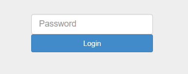

# Nuit du Hack CTF Quals 2018 - Notes

## AssemblyMe
> Description:
>
> We updated our website with the latest technologies. In addition, this is secure ! You can try to log in if you want...

打開題目頁面是一個輸入 password 的網頁


看一下 src code ，可以知道驗證用 checkAuth() 來回應

```html
<script src="index.js"></script>
<script>
	var button = document.getElementById('check');

	button.addEventListener('click', function(){

	u = document.getElementById("i").value;
	var a = Module.cwrap('checkAuth', 'string', ['string']);
	var b = a(u);
	document.getElementById("x").innerHTML = b;
	});
</script>

```

但我們無法直接看 checkAuth() ，因為他被編譯為  Web Assembly (在 index.wasm)

其他[參考](https://ctftime.org/task/5683) 