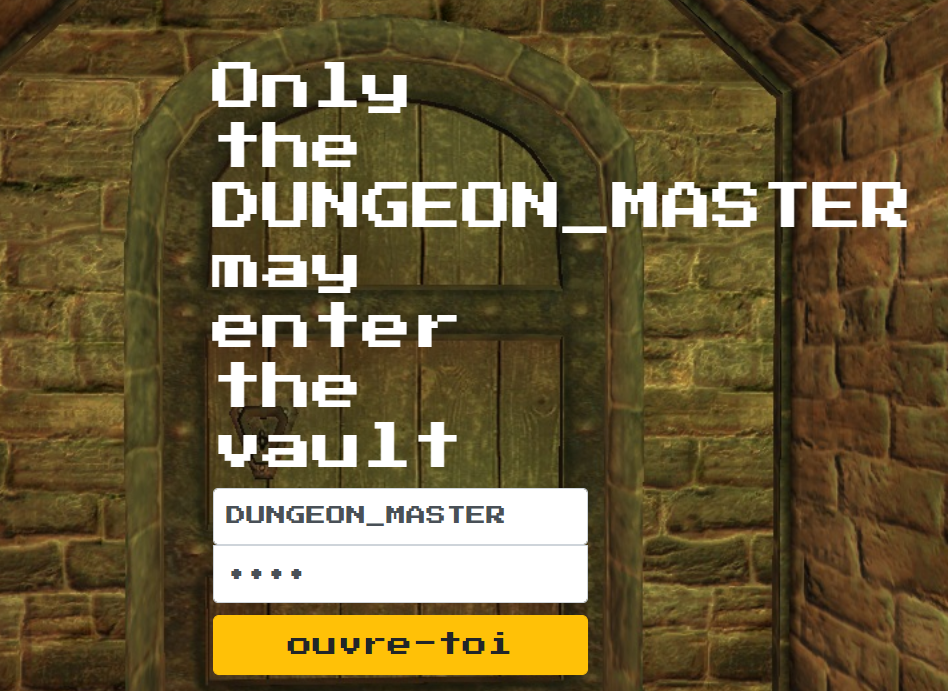

## SwampCTF 2018 - Notes


## The Vault
> Description:
>
> Has it been days? Weeks? You can't remember how long you've been standing at the door to the vault. You can't remember the last time you slept or ate, or had a drop of water, for that matter. But all of that is insignificant, in the presence of the untold fortunes that must lie just beyond the threshold.
> 
> But the door. It won't budge. It says it will answer only to the DUNGEON_MASTER. Have you not shown your worth? But more than that, It demands to know your secrets.
> 
> Nothing you've tried has worked. You've pled, begged, cursed, but the door holds steadfast, harshly judging your failed requests.
> 
> But with each failed attempt you start to notice more and more that there's something peculiar about the way the door responds to you.
> 
> Maybe the door knows more than it's letting on. ...Or perhaps it's letting on more than it knows?
> 
> NOTE: DO NOT USE AUTOMATED TOOLS Connect http://chal1.swampctf.com:2694

> -=Created By: juan=-

廢話很多，知道 username 是 DUNGEON_MASTER

先打開頁面



然後密碼隨便輸入，用 fiddler 看流量

```
HTTP/1.1 500 Internal Server Error
X-Powered-By: Express
Content-Security-Policy: default-src 'self'
X-Content-Type-Options: nosniff
Content-Type: text/html; charset=utf-8
Content-Length: 294
Date: Tue, 03 Apr 2018 11:55:12 GMT
Connection: keep-alive

<!DOCTYPE html>
<html lang="en">
<head>
<meta charset="utf-8">
<title>Error</title>
</head>
<body>
<pre>test_hash [9f86d081884c7d659a2feaa0c55ad015a3bf4f1b2b0b822cd15d6c15b0f00a08] does not match real_hash[40f5d109272941b79fdf078a0e41477227a9b4047ca068fff6566104302169ce]</pre>
</body>
</html>
```

這邊我密碼是輸入 test ，可以看到他生成 sha256 比對，那把上面的 real_hash 拿去解解看

這裡用該[網站](https://crackstation.net/)

解出得到密碼，登入得到 flag