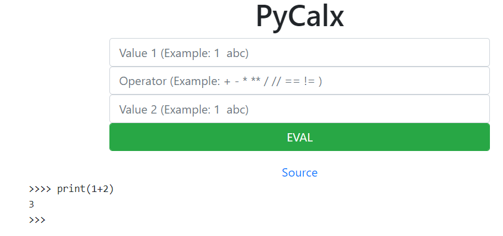
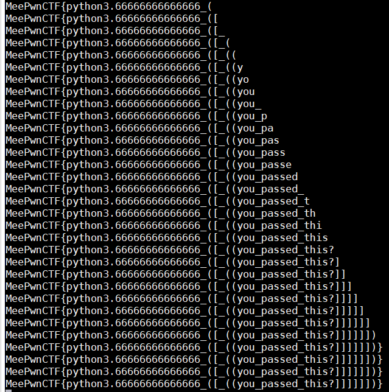

# meepwn ctf 2018 - Notes

## Ezchallz
> Description: http://206.189.92.209/ezchallz/

打開題目有兩個網址:
1. http://206.189.92.209/ezchallz/index.php
2. http://206.189.92.209/ezchallz/index.php?page=register

可以嘗試使用 local file inclusion
```
php://filter/convert.base64-encode/resource=
```

這樣可以獲取到 register.php 的 source code:
```php
<html>
<?php
error_reporting(0);

function gendirandshowflag($username) {
        include('secret.php');
        $dname = "";
        $intro = "";
        $_username = md5($username, $raw_output = TRUE);
        for($i = 0; $i<strlen($salt); $i++) {
                $dname.= chr(ord($salt[$i]) ^ ord($_username[$i]));
        };
        $dname = "users/" . bin2hex($dname);
        echo 'You have successfully register as ' . $username . '!\n';
        if ($_username === hex2bin('21232f297a57a5a743894a0e4a801fc3')) {
                $intro = "Here is your flag:" . $flag;
        }
        else {
                $intro = "Here is your flag, but I'm not sure 🤔: \nMeePwnCTF{" . md5(random_bytes(16) . $username) . "}";
        }
        mkdir($dname);
        file_put_contents($dname . '/flag.php', $intro);
        header("Location: ". $dname . "/flag.php");
}

if (isset($_POST['username'])) {
        if ($_POST['username'] === 'admin') {
                die('Username is not allowed!');
        }
        else {
                gendirandshowflag($_POST['username']);
        }
}
?>

        <form action="?page=register" method="POST">
        <input type="text" name="username"><br>
        <input type="submit" value="Register">
        </form>
</html>
```


和 index.php 的 src code
```php
<html>
<a href="index.php">Homepage</a>
<a href="?page=register">Free register</a></li>

<?php
if(isset($_GET["page"]) && !empty($_GET["page"])) {
    $page = $_GET["page"];
    if(strpos(strtolower($page), 'secret') !== false) {
        die('No no no!');
    }
//    else if(strpos($page, 'php') !== false) {
 //       die("N0 n0 n0!");
//    }
    else {
        include($page . '.php');
    }
}
?>
</html>
```


看 register.php 可以知道先算出 salt ，再依此算出 flag 的目錄即可看到 flag


## PyCalx

打開頁面如下



這題可控 repr，參考 source.py 可以知道他會處理 source , val1, val2, op 這四個參數

如果 source = 1 會印原始碼，而 val1, val2, op 這三個都有東西時會進一步處理

val1, val2 不可有黑名單的東西: `()[]'"` 且最長: 64 ，且必須全是數字或全是其他數字

op 最長: 2 ，且開頭需要是 `+-*/=!` 其中一個

最後會輸出:
```
str(eval(str(repr(value1)) + str(op) + str(repr(value2))))
```

並且結果必須全是數字或bool 值才會有輸出

repr 會返回該物件可印的形式，對大多數 type 而言會返回一個 string ，使其可以在 eval 下執行

而這題的關鍵點在 op 可允許兩個字，且第二個是任意的，所以可以給他單引號做到類似 sqli


然後在 Python 的字串比大小中，在不同長度下，如果兩方字串相同，則越長的越大

比如:
```
In [72]: 'aflag{' < 'af'
Out[72]: False
```

如果不同長度且字串不同，則看最後一個不同的字的大小
```
In [73]: 'aflag{' < 'ag'
Out[73]: True
```

所以如果:

value1 = `a`
op = `+'`
value2 = `+FLAG<value1+source#`

然後我們窮舉source 的值

假設flag = MeePwnCtf{ya} 好了

當我們的 source = M 會回傳 False，但 source=N 就會是 True

這樣就知道第一個字是 M

之後一樣改 source = Me 會是 False ，但 source = Mf 會是 True

以此類推可以找到 flag


執行腳本結果



## PyCalx2
> Description:
> http://206.189.223.3/cgi-bin/server.py?source=1

> The only difference from PyCalx is that the input from the operation field is checked for blacklisted characters.

這題和第一題的差別在他有對 op 做黑名單過濾，所以第一題放的單引號無法用在這一題

考 python 3.6 的新特性 - `f-string`

可以參考 [PEP 498 -- Literal String Interpolation](https://www.python.org/dev/peps/pep-0498/)

可以參考 [关于Python sec的一些简单的总结](http://www.bendawang.site/2018/03/01/%E5%85%B3%E4%BA%8EPython-sec%E7%9A%84%E4%B8%80%E4%BA%9B%E6%80%BB%E7%BB%93/)

簡單 f-string 用法:
```
>>> name = "price"
>>> price= 100
>>> f'{name.upper()} : {price}'
'PRICE : 100'
```

也就是表達式是 f'......'，然後單引號裡用要用函數或變數要先用 `{}` 包起來

所以設定如下:

value1 = `T`
op = `+f`
value2 = `ru{FLAG<source or 14:x}`

則如果 FLAG < source 會是 1 會顯示 Tru1 這樣 網頁會是 Invalid

如果 FLAG > source ，則會執行 `14:x` 也就是 0x14 = e ，這樣會顯示 True

之後寫腳本就跟第一題一樣了


[推薦參考](https://xz.aliyun.com/t/2456)